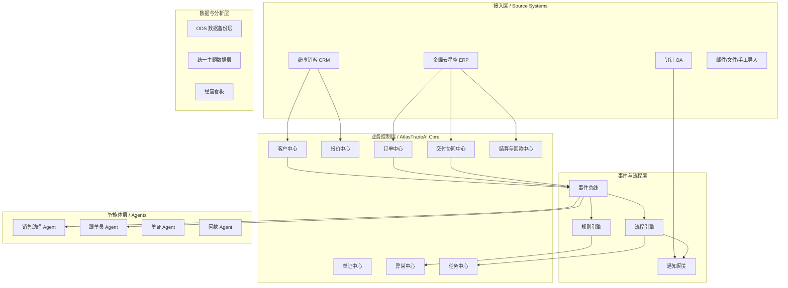
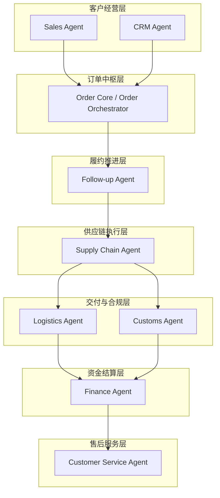
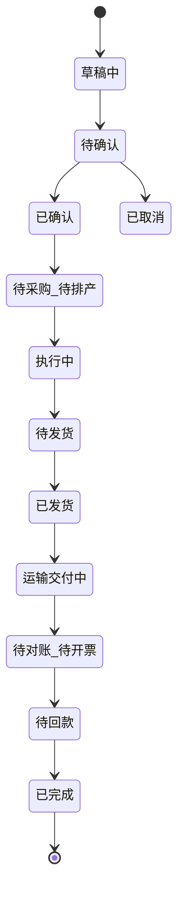
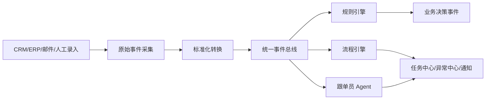
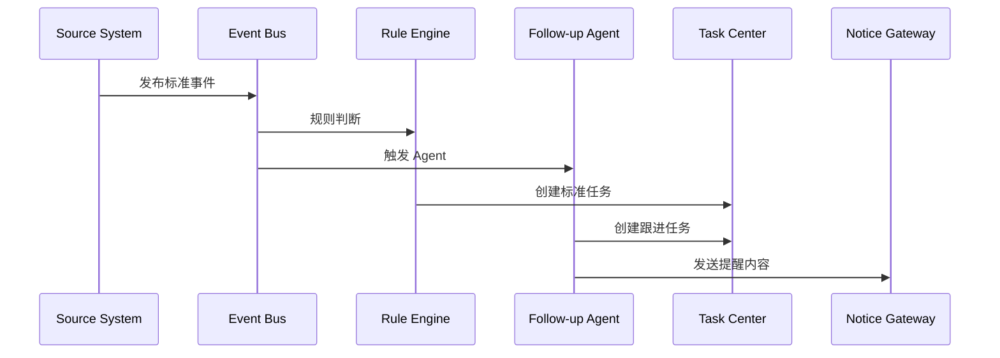
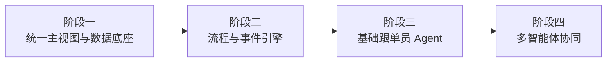

# AtlasTradeAI 项目需求分析与设计实现报告

## 一、项目背景

### 1.1 行业背景

贸易型公司在日常经营中面临一系列结构性问题：

- **数据分散**：客户、报价、订单、生产、物流、报关、收款等数据分散在不同人员和系统中
- **流程割裂**：内销和外贸流程高度相似，但在执行细节上存在明显差异，缺乏统一管理
- **人工依赖**：大量工作依赖人工跟进、反复沟通和表格协调
- **管理盲区**：管理层难以及时看到经营状态、交付风险和资金风险
- **效率瓶颈**：一线业务团队花费大量时间在录入、核对、追踪和催办上

### 1.2 项目定位

AtlasTradeAI 的定位是一个**面向贸易公司的经营操作系统加智能体层**。

它既不是单纯的聊天机器人项目，也不是简单替换现有 ERP 的项目，而是一个：

- 连接客户管理、报价、订单执行、工厂协同、发货、报关、国内运营与收款结算的**统一数字化经营平台**
- 在其上通过 AI 提升决策质量与执行效率的**智能化增强层**

### 1.3 核心目标

构建一个覆盖全链路的智能化数字运营系统，实现以下目标：

| 目标维度 | 具体内容 |
|---------|---------|
| 数据打通 | 打通跨部门分散的业务数据 |
| 流程统一 | 统一内销与外贸的核心经营流程 |
| 生命周期管理 | 让订单端到端生命周期可视化 |
| 风险管控 | 支撑风险预警、任务协同与异常处理 |
| 智能增强 | 引入 AI 智能体实现分析、建议与受控执行 |

---

## 二、需求分析

### 2.1 业务需求

#### 2.1.1 核心业务链路

系统以**订单全生命周期**为主线，核心业务链路如下：

```
客户 → 询盘 → 报价 → 样品 → 订单 → 采购/排产 → 质检 → 发货 → 报关 → 收货 → 开票 → 收款 → 售后 → 复购
```

#### 2.1.2 业务域覆盖

| 业务域 | 主要功能 |
|-------|---------|
| 客户与渠道管理 | 客户信息维护、客户分层、渠道管理 |
| 产品与报价管理 | 产品目录、报价单生成、价格策略 |
| 销售订单管理 | 订单创建、确认、变更、取消 |
| 采购与供应商协同 | 采购单管理、供应商管理 |
| 工厂与生产协同 | 排产计划、生产进度跟踪 |
| 仓储与库存管理 | 库存查询、出入库管理 |
| 物流与发运管理 | 发货安排、物流跟踪 |
| 报关与单证管理 | 单证制作、报关申报、合规校验 |
| 财务结算与收款管理 | 应收管理、开票、回款跟踪 |
| 国内运营与渠道管理 | 内销业务管理 |

#### 2.1.3 内销与外贸差异

系统需要兼容内销与外贸两种业务模式：

| 维度 | 内销 | 外贸 |
|-----|------|------|
| 单证要求 | 简单 | 复杂（PI/CI/PL/提单/原产地证等） |
| 报关流程 | 无 | 必须经过报关、清关 |
| 物流方式 | 国内物流 | 国际物流、海运/空运 |
| 结算方式 | 人民币结算 | 外币结算、汇兑损益 |
| 合规要求 | 国内法规 | 出口合规、HS编码 |

### 2.2 功能需求

#### 2.2.1 核心功能模块

```
┌─────────────────────────────────────────────────────────────┐
│                      业务控制层                              │
├─────────┬─────────┬─────────┬─────────┬─────────┬──────────┤
│客户中心 │报价中心 │订单中心 │交付协同 │单证中心 │回款中心  │
└─────────┴─────────┴─────────┴─────────┴─────────┴──────────┘
┌─────────────────────────────────────────────────────────────┐
│                      支撑能力层                              │
├─────────────────┬─────────────────┬─────────────────────────┤
│    任务中心     │    异常中心     │      通知中心           │
└─────────────────┴─────────────────┴─────────────────────────┘
```

#### 2.2.2 智能体需求

系统规划了多个业务角色智能体：

| 智能体 | 所属层级 | 核心职责 |
|-------|---------|---------|
| Sales Agent | 客户经营层 | 客户开发、报价、成交与规格协商 |
| CRM Agent | 客户经营层 | 客户沉淀、分层、画像分析 |
| Follow-up Agent | 履约推进层 | 跟单推进、异常识别、任务生成 |
| Supply Chain Agent | 供应链执行层 | 工厂协同、排产、采购管理 |
| Logistics Agent | 交付与合规层 | 发货安排、物流跟踪 |
| Customs Agent | 交付与合规层 | 单证完整性、报关合规校验 |
| Finance Agent | 资金结算层 | 应收管理、回款跟踪、利润核算 |
| Customer Service Agent | 售后服务层 | 售后支持、投诉处理 |

### 2.3 非功能需求

| 需求类型 | 具体要求 |
|---------|---------|
| 可追溯性 | 关键操作可追溯、可审计 |
| 可接管性 | AI 执行可人工接管 |
| 扩展性 | 支持新增业务域和智能体 |
| 集成性 | 与现有 CRM、ERP、OA 系统集成 |

---

## 三、系统架构设计

### 3.1 整体架构蓝图

系统采用**五层架构**设计：



### 3.2 核心架构模式："一个中枢 + 六层能力"

这是系统最重要的架构设计理念：



**设计理念**：
- **订单中枢**：不是普通 Agent，而是业务编排器、生命周期控制器、流程中枢
- **六层能力**：客户经营层、履约推进层、供应链执行层、交付与合规层、资金结算层、售后服务层
- **智能体嵌入**：多个角色型 Agent 嵌入业务层，由统一事件系统驱动

### 3.3 订单状态机设计

订单状态机是整个系统运行的核心骨架：



**主状态定义**：

| 状态 | 定义 | 关键检查项 |
|-----|------|----------|
| 草稿中 | 订单处于录入阶段 | - |
| 待确认 | 等待内部评审或客户确认 | 客户/产品/价格/交期/付款条件 |
| 已确认 | 可进入正式履约流程 | 具备执行资格 |
| 待采购/待排产 | 尚未完成供货准备 | 库存/采购/排产评估 |
| 执行中 | 实质履约执行阶段 | 采购/生产/验货 |
| 待发货 | 进入发货前准备 | 备货/单证/订舱 |
| 已发货 | 完成发货或出库 | 物流单号/发货单据 |
| 运输/交付中 | 货物在途 | 签收节点/报关状态 |
| 待对账/待开票 | 结算前置阶段 | 签收/对账/开票 |
| 待回款 | 应收管理阶段 | 回款计划/账期/逾期风险 |
| 已完成 | 全流程完成 | 主要回款责任关闭 |

### 3.4 统一事件模型

事件模型是流程自动化的底座：



**事件分类**：

| 事件类别 | 示例事件 |
|---------|---------|
| 客户与销售事件 | customer.created, quotation.sent, quotation.accepted |
| 订单事件 | order.created, order.confirmed, order.status_changed |
| 供应链与履约事件 | production.started, production.milestone_delayed, quality.failed |
| 单证与报关事件 | document.missing, customs.rejected, customs.cleared |
| 物流事件 | logistics.booked, logistics.delayed, logistics.delivered |
| 结算与回款事件 | payment.due_soon, payment.received, payment.overdue |

---

## 四、核心功能实现

### 4.1 技术栈

| 层次 | 技术选型 |
|-----|---------|
| 后端框架 | FastAPI (Python 3.11+) |
| 数据验证 | Pydantic |
| 数据库 | SQLite (演示) → MySQL/PostgreSQL (生产) |
| 前端 | 原生 HTML/JS (演示) |
| LLM 集成 | 智谱 AI (可选) |

### 4.2 代码架构

```
src/atlas_trade_ai/
├── api/                    # API 层
│   ├── router.py          # 路由注册
│   └── routes/            # 各业务模块路由
├── adapters/              # 外部系统适配层
│   ├── crm.py            # CRM 适配器
│   ├── erp.py            # ERP 适配器
│   └── dingtalk.py       # 钉钉适配器
├── core/                  # 核心基础设施
│   ├── bootstrap.py      # 种子数据
│   ├── store.py          # 数据存储
│   └── config_loader.py  # 配置加载
├── schemas/               # 数据模型定义
├── services/              # 业务服务层
├── agent.py               # 跟单员 Agent 实现
├── llm.py                 # LLM 集成
├── models.py              # Agent 上下文模型
├── rules.py               # 规则引擎
└── app.py                 # FastAPI 应用入口
```

### 4.3 跟单员 Agent 实现

跟单员 Agent 是系统第一个落地的智能体，采用**规则 + 大模型混合模式**：

```python
class FollowUpAgent:
    """Hybrid follow-up agent with rules as the stable execution backbone."""

    def run(self, context: AgentContext) -> AgentOutput:
        # 1. 规则判断（稳定执行骨干）
        decision = evaluate_context(context)
        output = build_output(context, decision)
        
        # 2. LLM 增强（可选）
        enhanced = self._enhance_with_llm(context, output)
        return enhanced or output
```

**Agent 输入上下文**：

```python
@dataclass
class AgentContext:
    trigger_event: TriggerEvent      # 触发事件
    order: OrderContext              # 订单上下文
    customer: CustomerContext        # 客户上下文
    fulfillment: FulfillmentContext  # 履约上下文
    payment: PaymentContext          # 回款上下文
```

**Agent 输出**：

```python
@dataclass
class AgentOutput:
    summary: str                      # 跟进摘要
    risk_assessment: RiskAssessment   # 风险评估
    recommended_actions: list[str]    # 建议动作
    task_drafts: list[TaskDraft]      # 任务草稿
    exception_marks: list[ExceptionMark]  # 异常标记
    notification_draft: str           # 通知草稿
```

### 4.4 事件驱动流程



---

## 五、分阶段实施路线

### 5.1 实施策略

```
先主干、后扩展 → 先数据、后自动化 → 先事件、后 Agent → 先跟单场景、后全面智能化
```

### 5.2 四阶段路线图



| 阶段 | 目标 | 重点建设 |
|-----|------|---------|
| 阶段一 | 打通客户、订单、交付、回款主链 | 数据同步、客户/订单/交付/回款主视图、基础看板 |
| 阶段二 | 建立系统主动感知与流程推动能力 | 事件模型、事件总线、状态机、任务中心、异常中心 |
| 阶段三 | 具备基础盯单和跟进辅助能力 | 跟单员 Agent、事件触发、跟进建议、风险摘要 |
| 阶段四 | 扩展到多岗位协同智能 | 销售/单证/回款/经营分析 Agent、多 Agent 协作 |

---

## 六、架构师视角

### 6.1 设计原则

| 原则 | 说明 |
|-----|------|
| 订单中心化 | 围绕订单生命周期设计，而非部门烟囱 |
| 渐进式智能化 | 先标准化流程，再做智能化自动化 |
| 数据先行 | 先统一主数据，再做跨系统整合 |
| 可见优先 | 先实现可视化和预警，再推进自动执行 |
| AI 增强层 | AI 作为增强层，而非核心交易控制层 |
| 可审计性 | 关键动作可追溯、可审计、可人工接管 |

### 6.2 架构亮点

1. **事件驱动架构**：从"人找问题"转变为"系统推问题"
2. **订单中枢模式**：以订单为唯一核心对象，统一协调各业务层
3. **混合智能模式**：规则引擎作为稳定骨干，LLM 作为增强层
4. **渐进式落地**：从 MVP 骨架开始，逐步扩展能力

### 6.3 与现有系统集成策略

```
┌─────────────────────────────────────────────────────────┐
│                    AtlasTradeAI                         │
│  ┌─────────────────────────────────────────────────┐   │
│  │              业务控制层 + 智能体层               │   │
│  └─────────────────────────────────────────────────┘   │
└─────────────────────────────────────────────────────────┘
         ↑                    ↑                    ↑
    数据同步              事件订阅              通知触达
         │                    │                    │
┌────────┴────────┐  ┌────────┴────────┐  ┌────────┴────────┐
│  纷享销客 CRM    │  │  金蝶云星空 ERP  │  │     钉钉 OA     │
│  (前台销售经营)  │  │ (正式数据/财务)  │  │   (触达通道)    │
└─────────────────┘  └─────────────────┘  └─────────────────┘
```

**集成原则**：
- CRM 负责前台销售经营过程
- ERP 负责正式业务数据与财务口径
- AtlasTradeAI 负责跨系统控制、聚合、提醒和智能化
- 钉钉负责触达，不负责主数据

### 6.4 技术债务与演进方向

| 当前状态 | 演进方向 |
|---------|---------|
| SQLite 演示数据库 | MySQL/PostgreSQL 生产数据库 |
| Mock 适配器 | 真实 CRM/ERP/钉钉集成 |
| 本地 JSON 配置 | 配置中心/数据库配置 |
| 原生前端 | 框架化前端工程 |
| 单一跟单员 Agent | 多 Agent 协同体系 |

---

## 七、总结

### 7.1 项目本质

AtlasTradeAI 是一个**订单驱动的智能贸易操作系统**，其本质是：

- 一个订单中枢
- 六层业务能力
- 多个角色 Agent 嵌入业务层
- 由统一事件系统驱动自动流转

### 7.2 核心价值

| 价值维度 | 具体体现 |
|---------|---------|
| 业务价值 | 打通全链路、统一流程、降低人工成本 |
| 管理价值 | 经营透明化、风险可视化、决策数据化 |
| 技术价值 | 事件驱动架构、可扩展智能体体系 |

### 7.3 当前状态

项目已完成第一版工程骨架，包含：
- API 层、服务层、数据层完整结构
- 事件处理链路
- 跟单员 Agent 原型实现
- 多页面前端应用
- Mock 集成适配层

这为后续的渐进式演进奠定了坚实基础。

---
        
            
toolName: todo_write
            
status: success
          
Todos updated: 5 items
          
以上就是 AtlasTradeAI 项目的完整需求分析与设计实现报告。这份文档从项目背景、需求分析、系统架构、核心功能实现、实施路线和架构师视角六个维度进行了全面阐述。

**关键要点总结**：

1. **项目定位**：不是简单的聊天机器人或 ERP 替换，而是以订单为核心的智能贸易操作系统

2. **核心架构**："一个中枢（订单中枢）+ 六层能力（客户经营、履约推进、供应链执行、交付合规、资金结算、售后服务）"

3. **技术特色**：
   - 事件驱动架构实现从"人找问题"到"系统推问题"的转变
   - 规则 + LLM 混合模式的智能体实现
   - 渐进式落地策略

4. **当前状态**：已完成第一版工程骨架，包含完整的 API 层、服务层、跟单员 Agent 原型和前端应用

如果需要我将这份文档保存为文件，或者需要针对某个部分进行更详细的展开，请告诉我。