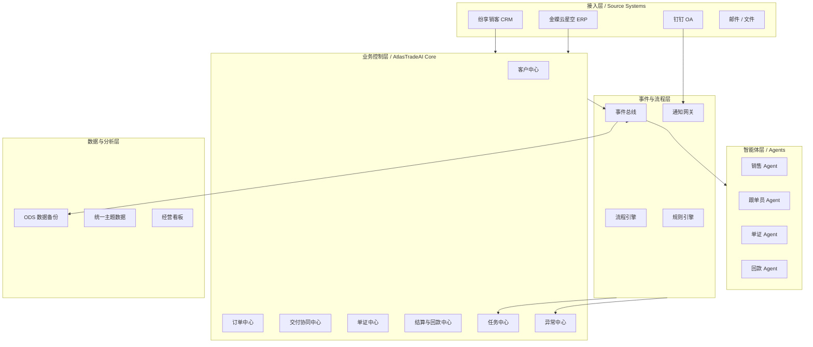
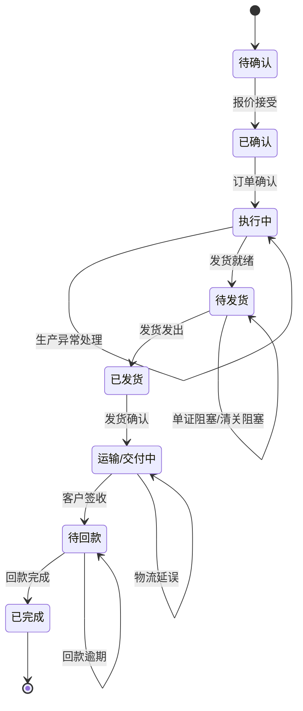
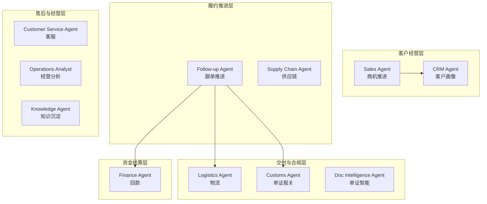
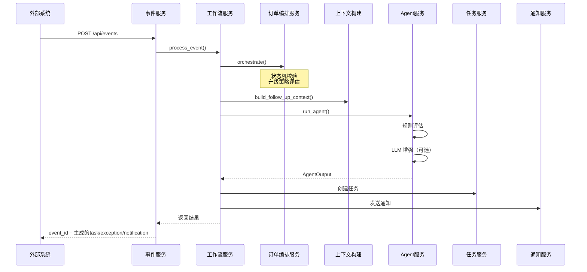
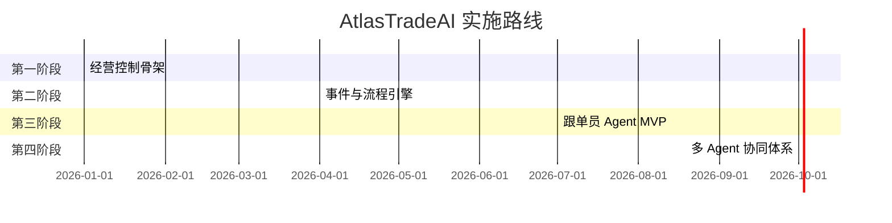

# AtlasTradeAI 项目需求分析与设计文档

## 一、项目背景

### 1.1 问题陈述

当前贸易公司面临以下核心挑战：

| 问题 | 现状 | 影响 |
|------|------|------|
| **系统孤岛** | CRM（纷享销客）、ERP（金蝶云星空）、钉钉 OA 各自独立 | 业务数据分散，难以形成统一视图 |
| **流程断点** | 跨部门协同依赖人工沟通和表格传递 | 响应慢、错误多、难以追溯 |
| **信息滞后** | 订单执行状态依赖人工盯单 | 异常发现晚，错过最佳处理时机 |
| **决策盲区** | 经营数据分散，口径不统一 | 管理层难以快速掌握真实经营状况 |

### 1.2 需求来源

- **业务侧**：销售、跟单、财务、单证、客服等角色在跨系统协同中的实际痛点
- **技术侧**：需要统一的事件驱动架构来连接现有系统并承载 AI 能力

---

## 二、项目定位

**AtlasTradeAI** 是一个面向贸易公司的**智能经营操作系统 + AI 智能体层**。

```
┌─────────────────────────────────────────────────────────────────┐
│                     AtlasTradeAI 定位                           │
├─────────────────────────────────────────────────────────────────┤
│  ✗ 不是单纯的聊天机器人                                         │
│  ✗ 不是要替换现有 ERP/CRM                                       │
│  ✓ 而是：在现有系统之上构建经营控制平台                          │
│  ✓ 以订单全生命周期为主线                                       │
│  ✓ 以事件为驱动、以任务/异常为抓手                               │
│  ✓ 以 AI 智能体为增强层                                         │
└─────────────────────────────────────────────────────────────────┘
```

---

## 三、系统架构设计

### 3.1 五层架构总览



### 3.2 核心模块职责

| 层级 | 模块 | 核心职责 |
|------|------|----------|
| **接入层** | CRM/ERP/钉钉适配器 | 获取原始数据、变更事件 |
| **业务控制层** | 客户/订单/交付/单证/结算/异常/任务中心 | 维护统一业务主视图、控制状态推进 |
| **事件与流程层** | 事件总线、规则引擎、流程引擎、通知网关 | 事件路由、规则匹配、自动任务、消息推送 |
| **数据与分析层** | ODS、主题数据层、BI、分析服务 | 数据备份、口径统一、指标输出 |
| **智能体层** | 11 种角色 Agent | 分析建议、风险识别、任务编排 |

---

## 四、核心模块详解

### 4.1 事件驱动架构

系统以**事件**为核心驱动力，所有业务变更都转化为事件：

```python
# 事件模型
class TriggerEvent:
    event_id: str           # 事件唯一标识
    event_type: str         # 事件类型（如 production.milestone_delayed）
    event_time: str         # 事件发生时间
    source_system: str       # 来源系统
    biz_object_type: str    # 业务对象类型
    biz_object_id: str      # 业务对象ID
```

**事件类型目录**（19 种事件）：

| 事件类型 | 领域 | 优先级 | 说明 |
|----------|------|--------|------|
| `production.milestone_delayed` | 供应链 | P1 | 生产里程碑延期 |
| `document.missing` | 合规 | P1 | 单证资料缺失 |
| `payment.overdue` | 财务 | P1 | 回款已逾期 |
| `customs.rejected` | 合规 | P1 | 报关被驳回 |
| `logistics.delayed` | 交付 | P2 | 物流延误 |
| `payment.due_soon` | 财务 | P2 | 回款临近账期 |
| `shipment.ready` | 交付 | P2 | 发货就绪 |
| `order.confirmed` | 订单 | P2 | 订单已确认 |
| `payment.completed` | 财务 | P3 | 回款完成 |
| ... | ... | ... | ... |

### 4.2 订单状态机



### 4.3 智能体体系（11 种 Agent）



**Agent 执行模式**：
- **Hybrid（混合模式）**：规则引擎 + LLM 增强，保证稳定性与智能化
- **Rules（纯规则模式）**：仅使用规则引擎，适合关键决策场景

---

## 五、数据模型

### 5.1 核心数据表

| 表名 | 说明 | 关键字段 |
|------|------|----------|
| `customers` | 客户主数据 | customer_id, name, level, business_type |
| `orders` | 订单主数据 | order_id, no, status, risk_level, payment_status |
| `tasks` | 任务表 | task_id, title, assignee, priority, status |
| `exceptions` | 异常表 | exception_id, type, level, status, owner |
| `events` | 事件表 | event_id, type, time, source_system |
| `notifications` | 通知表 | notification_id, channel, template_code, sent |
| `agent_runs` | Agent 执行记录 | run_id, agent_name, input, output |

### 5.2 Agent 上下文模型

```python
class AgentContext:
    trigger_event: TriggerEvent   # 触发事件
    order: OrderContext           # 订单上下文
    customer: CustomerContext      # 客户上下文
    fulfillment: FulfillmentContext  # 履约上下文
    payment: PaymentContext       # 付款上下文
```

---

## 六、核心处理流程

### 6.1 事件处理主流程



### 6.2 升级策略

系统支持**动态升级**，根据以下维度评估升级级别：

| 维度 | 触发条件 | 升级级别 |
|------|----------|----------|
| 阻塞事件 | `blocked=true` + `immediate` 策略 | High |
| 同类事件重复触发 | ≥2 次同类事件 | High → Critical |
| 未解决异常积累 | ≥2 条未关闭异常 | High |
| P1 优先级事件 | 优先级=P1 | High → Critical |
| 高价值客户 + 阻塞 | 战略/重点客户 + 阻塞 | Critical |
| 复合风险信号 | 生产异常 + 单证异常同时存在 | Critical |
| 交付+资金复合风险 | 物流延误 + 回款逾期同时存在 | Critical |

---

## 七、技术实现

### 7.1 技术栈

| 组件 | 技术选型 | 用途 |
|------|----------|------|
| **Web 框架** | FastAPI | 高性能异步 API |
| **数据验证** | Pydantic v2 | 数据模式定义 |
| **数据存储** | SQLite | 演示/开发环境 |
| **LLM 集成** | OpenAI / 智谱 GLM | 智能增强 |
| **消息通知** | 钉钉 Webhook/OpenAPI | 企业级通知 |
| **依赖注入** | 手动容器模式 | 服务管理 |

### 7.2 项目结构

```
src/atlas_trade_ai/
├── app.py              # FastAPI 入口
├── container.py        # 依赖注入容器
├── models.py           # 核心数据模型
├── rules.py            # 规则引擎
├── llm.py              # LLM 接口封装
├── agent.py            # 跟单员 Agent
│
├── adapters/           # 外部系统适配器
│   ├── dingtalk.py     # 钉钉适配器
│   ├── erp.py          # ERP 适配器
│   └── crm.py          # CRM 适配器
│
├── api/routes/         # API 路由层（21个端点）
├── services/           # 业务服务层（25个服务）
├── schemas/            # Pydantic 模式
└── core/               # 核心基础设施
    ├── store.py        # SQLite 存储
    ├── bootstrap.py    # 种子数据
    └── config_loader.py # 配置加载
```

---

## 八、配置体系

| 配置文件 | 用途 |
|----------|------|
| `agent_catalog.json` | 11 种 Agent 定义、订阅事件、执行模式 |
| `event_catalog.json` | 19 种业务事件定义 |
| `order_orchestration_rules.json` | 订单状态机、事件-状态映射、升级策略 |
| `workflow_rules.json` | 工作流编排规则 |
| `organization_directory.json` | 组织架构与 Agent 负责人映射 |
| `mock_integrations.json` | Mock 集成数据 |

---

## 九、环境配置

```bash
# 数据库
ATLAS_DB_PATH=data/atlas_trade_ai_demo.sqlite

# LLM 配置
ATLAS_LLM_PROVIDER=openai|zhipu
OPENAI_API_KEY=xxx
ZHIPU_API_KEY=xxx
ATLAS_AGENT_MODEL=gpt-4o-mini

# Agent 执行模式
ATLAS_AGENT_MODE=hybrid|rules

# 钉钉集成
DINGTALK_MODE=mock|webhook|openapi
DINGTALK_WEBHOOK_URL=xxx
```

---

## 十、分阶段实施路线



| 阶段 | 目标 | 核心交付 |
|------|------|----------|
| **第一阶段** | 经营控制骨架 | 订单中心、交付协同、任务/异常中心、ODS、BI |
| **第二阶段** | 事件与流程引擎 | 事件总线、规则引擎、流程引擎、自动提醒 |
| **第三阶段** | 跟单员 Agent MVP | 跟单建议生成、风险识别、任务自动创建 |
| **第四阶段** | 多 Agent 协同 | 销售/单证/回款/经营分析 Agent 体系 |

---

## 十一、项目亮点总结

| 亮点 | 说明 |
|------|------|
| **事件驱动** | 以业务事件为核心触发点，实现松耦合架构 |
| **混合智能** | 规则引擎 + LLM 双重保障，兼顾稳定性与智能化 |
| **订单中枢** | 统一管理订单全生命周期状态 |
| **智能升级** | 多维度动态评估升级级别和责任人 |
| **多 Agent 协同** | 11 种角色 Agent 各司其职，协同处理 |
| **完整文档** | 45 个 Markdown 文档详细记录架构设计 |
| **工程骨架** | 完整可运行的 MVP，验证核心设计思路 |

---

## 十二、快速启动

```bash
# 启动 API 服务
PYTHONPATH=src uvicorn atlas_trade_ai.app:app --reload

# 访问入口
http://127.0.0.1:8000/platform    # 前端平台
http://127.0.0.1:8000/docs       # API 文档
http://127.0.0.1:8000/ui/index.html  # 多页面前端
```

---

以上是对 **AtlasTradeAI** 项目的完整需求分析和设计文档，涵盖了项目背景、系统架构、核心模块、数据模型、处理流程、技术实现和实施路线等方面。如需进一步了解某个具体模块，可以参考 `docs/` 目录下的详细文档。