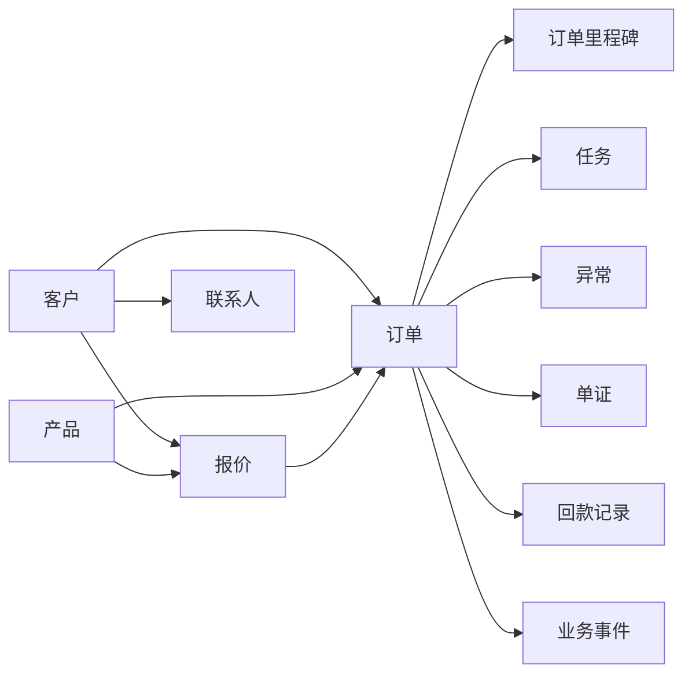

# 核心业务对象与字段草案

## 1. 文档目的

本文档用于定义 AtlasTradeAI 第一阶段需要统一抽象的核心业务对象，以及这些对象建议具备的关键字段。

本文档的目标不是直接产出数据库表结构，而是先明确：

- 系统中最核心的业务对象有哪些
- 对象之间的关系是什么
- 第一阶段最关键的字段应该是什么

## 2. 设计原则

核心业务对象设计建议遵循以下原则：

- 围绕订单主线展开
- 一类对象只承载一类核心业务语义
- 支持与 CRM、ERP、钉钉、多智能体的关联
- 优先定义第一阶段高价值字段
- 支持内销与外贸共用主干、差异化扩展

## 3. 核心业务对象总览

第一阶段建议优先统一以下对象：

- 客户
- 联系人
- 产品
- 报价
- 订单
- 订单里程碑
- 任务
- 异常
- 单证
- 回款记录
- 业务事件

## 4. 客户对象

### 4.1 对象说明

客户对象是经营链路的起点，用于统一 CRM、ERP 和外部经营操作层中的客户身份。

### 4.2 建议关键字段

- `customer_id`
- `customer_name`
- `customer_code`
- `customer_type`
- `business_type`
- `country_or_region`
- `industry`
- `channel_type`
- `crm_source_id`
- `erp_source_id`
- `owner_id`
- `customer_level`
- `credit_level`
- `payment_terms`
- `status`

### 4.3 说明

其中建议重点关注：

- `business_type`
  - 内销
  - 外贸
  - 混合
- `customer_level`
  - 战略客户
  - 重点客户
  - 普通客户
- `payment_terms`
  - 现款
  - 账期
  - 分阶段付款

## 5. 联系人对象

### 5.1 对象说明

联系人对象用于承接客户内部的具体业务对接人。

### 5.2 建议关键字段

- `contact_id`
- `customer_id`
- `contact_name`
- `job_title`
- `phone`
- `email`
- `wechat`
- `is_primary`
- `language`
- `status`

## 6. 产品对象

### 6.1 对象说明

产品对象用于统一产品、SKU、型号、规格等商品主数据。

### 6.2 建议关键字段

- `product_id`
- `product_code`
- `product_name`
- `sku_code`
- `category`
- `specification`
- `unit`
- `brand`
- `business_line`
- `erp_item_id`
- `status`

## 7. 报价对象

### 7.1 对象说明

报价对象用于承接询盘到订单之间的价格和方案上下文。

### 7.2 建议关键字段

- `quotation_id`
- `customer_id`
- `owner_id`
- `quotation_no`
- `quotation_date`
- `currency`
- `total_amount`
- `gross_margin_estimate`
- `valid_until`
- `quotation_status`
- `source_channel`

### 7.3 报价明细关键字段

- `quotation_line_id`
- `quotation_id`
- `product_id`
- `quantity`
- `unit_price`
- `amount`
- `delivery_date_estimate`

## 8. 订单对象

### 8.1 对象说明

订单对象是整个系统的核心对象。

### 8.2 建议关键字段

- `order_id`
- `order_no`
- `customer_id`
- `quotation_id`
- `business_type`
- `trade_type`
- `currency`
- `total_amount`
- `owner_id`
- `current_status`
- `sub_status`
- `risk_level`
- `planned_delivery_date`
- `actual_delivery_date`
- `payment_status`
- `settlement_status`
- `crm_order_id`
- `erp_order_id`
- `created_time`
- `confirmed_time`

### 8.3 外贸扩展字段

- `incoterms`
- `destination_country`
- `customs_status`
- `document_status`
- `logistics_status`

### 8.4 内销扩展字段

- `channel_customer_type`
- `domestic_delivery_status`
- `invoice_status`
- `reconciliation_status`
- `account_period_status`

## 9. 订单里程碑对象

### 9.1 对象说明

订单里程碑用于记录订单生命周期中的关键节点计划与实际完成情况。

### 9.2 建议关键字段

- `milestone_id`
- `order_id`
- `milestone_type`
- `planned_time`
- `actual_time`
- `milestone_status`
- `owner_id`
- `is_overdue`
- `remark`

### 9.3 推荐里程碑类型

- 报价完成
- 订单确认
- 采购完成
- 排产完成
- 生产完成
- 验货完成
- 发货完成
- 报关完成
- 收货完成
- 回款完成

## 10. 任务对象

### 10.1 对象说明

任务对象用于承接系统自动生成或人工创建的待处理事项。

### 10.2 建议关键字段

- `task_id`
- `task_type`
- `task_title`
- `task_source`
- `related_order_id`
- `related_customer_id`
- `related_exception_id`
- `assignee_id`
- `priority`
- `due_time`
- `task_status`
- `created_by`
- `created_time`
- `completed_time`

## 11. 异常对象

### 11.1 对象说明

异常对象用于承接业务风险和阻塞问题。

### 11.2 建议关键字段

- `exception_id`
- `exception_type`
- `exception_level`
- `related_order_id`
- `related_customer_id`
- `source_event_id`
- `owner_id`
- `exception_status`
- `detected_time`
- `expected_recovery_time`
- `suggestion`
- `resolution_note`

## 12. 单证对象

### 12.1 对象说明

单证对象主要面向外贸订单，用于管理 PI、CI、PL、合同及其他出口文件。

### 12.2 建议关键字段

- `document_id`
- `order_id`
- `document_type`
- `document_no`
- `document_status`
- `version_no`
- `file_url`
- `generated_time`
- `validated_time`
- `owner_id`

## 13. 回款记录对象

### 13.1 对象说明

回款记录对象用于承接订单的应收、到账、逾期和分期回款情况。

### 13.2 建议关键字段

- `payment_record_id`
- `order_id`
- `customer_id`
- `receivable_amount`
- `received_amount`
- `currency`
- `due_date`
- `received_date`
- `payment_status`
- `overdue_days`
- `owner_id`

## 14. 业务事件对象

### 14.1 对象说明

业务事件对象是统一事件模型的落地承载。

### 14.2 建议关键字段

- `event_id`
- `event_type`
- `biz_object_type`
- `biz_object_id`
- `source_system`
- `event_time`
- `payload`
- `trace_id`
- `risk_level`

## 15. 第一阶段对象优先级建议

如果从 MVP 角度排序，建议优先落以下对象：

1. 客户
2. 订单
3. 订单里程碑
4. 任务
5. 异常
6. 业务事件
7. 回款记录

## 16. 文档结论

核心业务对象与字段定义，是后续做主数据映射、状态机、任务中心、异常中心和 Agent 输入输出协议的前提。

第一阶段不必把所有对象做得很重，但必须先把订单相关的主干对象统一起来。
