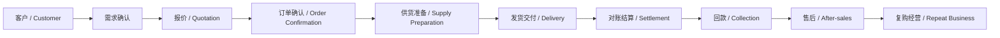
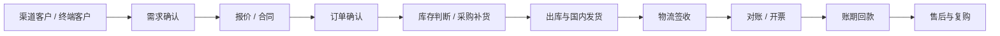

# 内销与外贸流程差异说明

## 1. 文档目的

本文档用于对比内销业务与外贸业务在端到端流程中的共性与差异，并提炼出一套能够同时支持两类业务的统一主干模型。

该文档的目标不是把两条流程分开设计，而是明确：

- 哪些环节可以共用
- 哪些环节必须分流
- 系统中应该如何抽象统一对象
- 后续模块设计如何避免重复建设

## 2. 设计结论先行

对于本项目，建议采用：

- 一套统一的订单主干模型
- 两套差异化执行分支
- 一套统一的事件、任务、异常和看板体系

也就是说，系统不应该做成“内销一套、外贸一套”，而应该做成：

统一经营主干 + 内销分支能力 + 外贸分支能力

## 3. 两类业务的共用主流程

内销与外贸虽然在执行细节上不同，但其核心经营逻辑是相同的。

共用主流程可以抽象为：

客户 -> 需求确认 -> 报价 -> 订单确认 -> 供货准备 -> 发货交付 -> 对账结算 -> 回款 -> 售后 -> 复购

## 4. 外贸业务的典型扩展流程

外贸业务在统一主干之上，会增加更多国际贸易相关环节。

主要增加的节点包括：

- 询盘与邮件往来
- 样品管理
- PI / CI / PL 等单证
- 报关资料准备
- 国际物流与订舱
- 出口合规
- 外汇回款

## 5. 内销业务的典型扩展流程

内销业务在统一主干之上，会更强调渠道、库存、发货、账期和国内结算。

主要增加的节点包括：

- 渠道客户管理
- 库存可用量判断
- 国内仓发货
- 物流配送
- 对账单与发票
- 账期催收

## 6. 共性与差异对比

### 6.1 共性环节

以下环节应统一设计：

- 客户主数据
- 产品主数据
- 报价管理
- 订单主数据
- 订单状态机
- 供应链协同
- 发货状态
- 对账与回款
- 售后记录
- 任务、异常、提醒
- 管理看板

### 6.2 外贸差异环节

以下能力更偏向外贸：

- 邮件驱动的客户沟通
- 样品跟踪
- 外贸单证管理
- 报关流程
- 国际物流节点
- 出口合规要求
- 外汇回款跟踪

### 6.3 内销差异环节

以下能力更偏向内销：

- 渠道客户与区域管理
- 现货库存判断
- 国内仓配协同
- 国内物流签收
- 账期与发票协同
- 渠道对账

## 7. 对系统模块设计的启示

基于上述差异，建议模块设计采用“主干模块 + 分支模块”的方式。

### 7.1 主干模块

必须统一建设的模块：

- 客户中心
- 产品中心
- 报价中心
- 订单中心
- 任务中心
- 异常中心
- 交付中心
- 结算中心
- 经营看板

### 7.2 外贸分支模块

建议单独建设的模块：

- 邮件与询盘协同
- 样品管理
- 单证中心
- 报关中心
- 国际物流跟踪
- 外汇回款辅助

### 7.3 内销分支模块

建议单独建设的模块：

- 渠道运营支持
- 国内仓配协同
- 国内对账与账期管理
- 发票协同

## 8. 对数据模型设计的启示

系统中的核心业务对象应统一，但允许分支字段存在。

例如订单对象建议采用：

- 统一主字段
  - 客户
  - 产品
  - 数量
  - 金额
  - 交期
  - 状态
  - 回款状态
- 外贸扩展字段
  - 贸易方式
  - 币种
  - 报关状态
  - 单证状态
  - 国际物流状态
- 内销扩展字段
  - 渠道类型
  - 发票状态
  - 对账状态
  - 国内物流状态
  - 账期状态

这种设计可以避免因为业务差异而拆成两套孤立系统。

## 9. 对事件体系设计的启示

后续你要实现事件驱动的跟单员 Agent，这一层尤其要统一。

建议不区分内销和外贸的事件底座，而是定义统一事件模型，例如：

- 客户创建
- 报价发送
- 样品寄出
- 订单确认
- 采购下达
- 生产延期
- 发货完成
- 报关异常
- 客户签收
- 开票完成
- 回款逾期

对于外贸和内销，只是在事件属性和后续动作上有差异，而不是事件机制本身不同。

## 10. 建议的统一抽象方法

本项目建议使用以下统一抽象：

- 一个统一客户对象
- 一个统一订单对象
- 一个统一订单状态机
- 一个统一任务中心
- 一个统一异常中心
- 一个统一事件中心
- 一套分业务类型的扩展字段和分支规则

## 11. 文档结论

对于 AtlasTradeAI，正确的设计方向不是“分别做内销系统和外贸系统”，而是：

以订单主线为骨架，以统一事件与任务体系为中枢，以差异化执行模块承接具体业务差异。

这样才能让后续的流程自动化、智能体触发和经营分析建立在统一结构之上。
