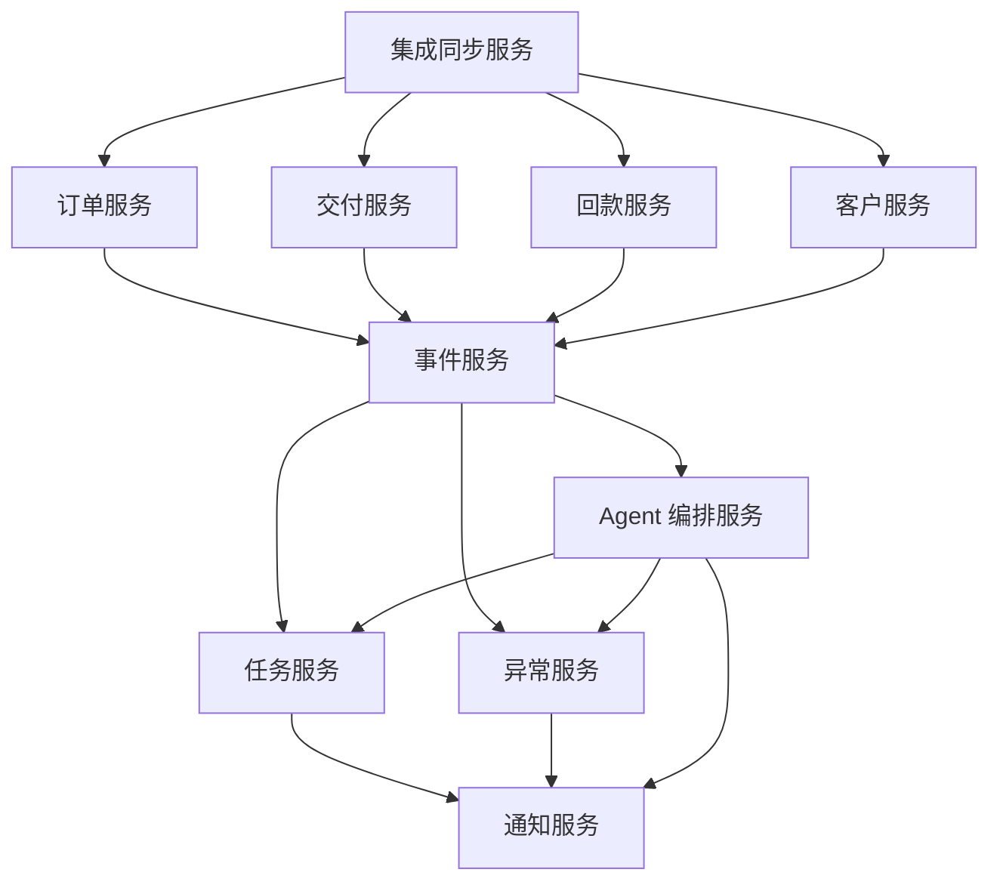

# 核心接口与服务边界草案

## 1. 文档目的

本文档用于定义 AtlasTradeAI 第一阶段核心服务边界，以及模块间建议暴露的核心接口方向。

## 2. 设计目标

本草案主要回答：

- 系统内部应拆成哪些核心服务
- 各服务应负责什么
- 各服务之间通过什么对象交互

## 3. 服务边界建议

建议第一阶段采用领域服务边界，而不是围绕现有系统来拆。

建议服务包括：

- 客户服务
- 订单服务
- 交付服务
- 回款服务
- 任务服务
- 异常服务
- 事件服务
- 集成同步服务
- 通知服务
- Agent 编排服务

## 4. 服务职责说明

### 4.1 客户服务

负责：

- 统一客户主档
- 联系人信息
- 客户等级与基础经营属性

### 4.2 订单服务

负责：

- 订单主视图
- 订单状态机
- 订单详情聚合
- 订单与报价映射

### 4.3 交付服务

负责：

- 订单里程碑
- 发货状态
- 单证状态引用
- 交付风险识别输入

### 4.4 回款服务

负责：

- 应收信息聚合
- 回款状态
- 账期信息
- 逾期信息

### 4.5 任务服务

负责：

- 创建任务
- 更新任务
- 查询待办
- 任务状态流转

### 4.6 异常服务

负责：

- 创建异常
- 更新异常
- 异常分级
- 异常与订单、任务关联

### 4.7 事件服务

负责：

- 接收标准事件
- 存储事件
- 分发事件
- 提供事件查询

### 4.8 集成同步服务

负责：

- CRM / ERP 数据同步
- 字段映射
- 主键映射
- 原始变更标准化

### 4.9 通知服务

负责：

- 钉钉消息发送
- 钉钉待办推送
- 去重与频控

### 4.10 Agent 编排服务

负责：

- 触发跟单员 Agent
- 组装上下文
- 落地 Agent 输出

## 5. 核心接口方向建议

### 5.1 订单服务接口

建议至少包括：

- 查询订单列表
- 查询订单详情
- 更新订单状态
- 查询订单里程碑
- 查询订单关联任务
- 查询订单关联异常

### 5.2 任务服务接口

建议至少包括：

- 创建任务
- 更新任务状态
- 查询我的任务
- 查询订单相关任务

### 5.3 异常服务接口

建议至少包括：

- 创建异常
- 更新异常状态
- 查询异常列表
- 查询订单相关异常

### 5.4 事件服务接口

建议至少包括：

- 写入标准事件
- 查询事件列表
- 按对象查询事件
- 分发事件到订阅方

### 5.5 Agent 编排服务接口

建议至少包括：

- 触发跟单员 Agent
- 传入上下文
- 接收 Agent 输出
- 将输出落入任务 / 异常 / 通知

## 6. 服务之间的对象边界建议

建议统一通过以下对象交互：

- CustomerDTO
- OrderDTO
- MilestoneDTO
- TaskDTO
- ExceptionDTO
- EventDTO
- AgentContextDTO
- AgentOutputDTO

## 7. 第一阶段实施建议

第一阶段不需要追求复杂微服务化，但边界必须先定义清楚。

即使一开始以单体或模块化方式实现，也建议按服务边界组织代码和接口。

## 8. 文档结论

服务边界的价值，不是为了把系统拆碎，而是为了确保订单、事件、任务、异常和 Agent 之间的协作关系从一开始就清晰稳定。
