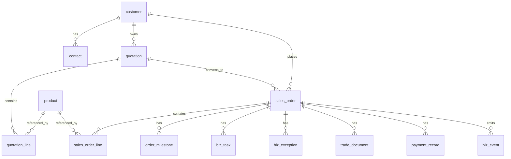

# 数据库逻辑模型草案

## 1. 文档目的

本文档用于定义 AtlasTradeAI 第一阶段数据库逻辑模型的对象关系草案。

本文档不直接等同于物理建表脚本，但可以作为后续数据库设计与 ORM 建模的基础。

## 2. 设计原则

逻辑模型设计建议遵循以下原则：

- 以订单为中心
- 优先支撑主视图、任务、异常、事件和 Agent
- 保留与 CRM / ERP 的映射字段
- 支持主数据与业务数据分层

## 3. 核心实体

建议第一阶段核心实体包括：

- customer
- contact
- product
- quotation
- quotation_line
- sales_order
- sales_order_line
- order_milestone
- biz_event
- biz_task
- biz_exception
- trade_document
- payment_record
- system_mapping

## 4. 逻辑关系图

## 5. 关键实体说明

### 5.1 customer

用于统一客户主数据。

关键字段建议：

- id
- customer_name
- business_type
- country_region
- customer_level
- crm_source_id
- erp_source_id

### 5.2 sales_order

用于承载订单主数据。

关键字段建议：

- id
- order_no
- customer_id
- quotation_id
- current_status
- sub_status
- risk_level
- planned_delivery_date
- payment_status
- crm_order_id
- erp_order_id

### 5.3 order_milestone

用于承载订单各关键节点计划与实际。

关键字段建议：

- id
- order_id
- milestone_type
- planned_time
- actual_time
- milestone_status
- is_overdue

### 5.4 biz_event

用于承载标准事件。

关键字段建议：

- id
- event_type
- biz_object_type
- biz_object_id
- source_system
- event_time
- payload_json

### 5.5 biz_task

用于承载任务中心数据。

关键字段建议：

- id
- task_type
- order_id
- exception_id
- assignee_id
- priority
- due_time
- task_status

### 5.6 biz_exception

用于承载异常中心数据。

关键字段建议：

- id
- exception_type
- exception_level
- order_id
- source_event_id
- owner_id
- exception_status

### 5.7 payment_record

用于承载回款记录。

关键字段建议：

- id
- order_id
- receivable_amount
- received_amount
- due_date
- received_date
- payment_status

### 5.8 system_mapping

用于承载 AtlasTradeAI 与外部系统的主键映射关系。

关键字段建议：

- id
- mapping_type
- atlas_object_id
- source_system
- source_object_id

## 6. 逻辑分层建议

建议逻辑上分成三层：

- 主数据层
  - customer
  - contact
  - product
- 业务主线层
  - quotation
  - sales_order
  - order_milestone
  - payment_record
  - trade_document
- 控制与协同层
  - biz_event
  - biz_task
  - biz_exception
  - system_mapping

## 7. 第一阶段最小建模范围

如果只做 MVP，建议优先建以下实体：

- customer
- sales_order
- order_milestone
- biz_event
- biz_task
- biz_exception
- payment_record
- system_mapping

## 8. 文档结论

数据库逻辑模型的关键，不是一次性把所有业务对象都建全，而是优先支撑统一订单主线、事件机制、任务中心、异常中心和跟单员 Agent 的实现。
