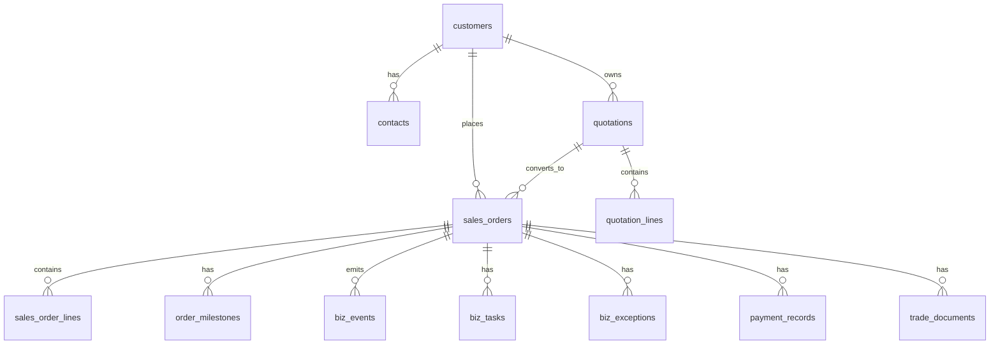

# 数据库表结构草案（字段级）

## 1. 文档目的

本文档用于细化 AtlasTradeAI 第一阶段数据库表结构，给出字段级草案，作为后续数据建模、ORM 建模与数据库初始化的参考。

本文档基于此前的《数据库逻辑模型草案》，进一步落实到表级和字段级。

## 2. 设计原则

第一阶段数据库设计建议遵循以下原则：

- 以订单主线为中心
- 优先支持事件、任务、异常、Agent 原型
- 保留与 CRM / ERP 的映射字段
- 字段设计兼顾前端查询与后续扩展

## 3. 第一阶段核心表清单

建议第一阶段至少建立以下表：

- `customers`
- `contacts`
- `quotations`
- `quotation_lines`
- `sales_orders`
- `sales_order_lines`
- `order_milestones`
- `biz_events`
- `biz_tasks`
- `biz_exceptions`
- `payment_records`
- `trade_documents`
- `system_mappings`

## 4. 表关系概览

## 5. 表结构草案

### 5.1 `customers`

| 字段名 | 类型 | 非空 | 默认值 | 说明 |
| --- | --- | --- | --- | --- |
| `id` | varchar(64) | 是 |  | 主键 |
| `customer_name` | varchar(255) | 是 |  | 客户名称 |
| `customer_code` | varchar(100) | 否 | null | 客户编码 |
| `customer_type` | varchar(50) | 否 | null | 客户类型 |
| `business_type` | varchar(50) | 是 |  | 内销 / 外贸 / 混合 |
| `country_or_region` | varchar(100) | 否 | null | 国家或地区 |
| `industry` | varchar(100) | 否 | null | 行业 |
| `channel_type` | varchar(100) | 否 | null | 渠道类型 |
| `owner_id` | varchar(64) | 否 | null | 负责人 |
| `customer_level` | varchar(50) | 否 | null | 客户等级 |
| `credit_level` | varchar(50) | 否 | null | 信用等级 |
| `payment_terms` | varchar(100) | 否 | null | 账期条件 |
| `crm_source_id` | varchar(100) | 否 | null | CRM 来源 ID |
| `erp_source_id` | varchar(100) | 否 | null | ERP 来源 ID |
| `status` | varchar(50) | 是 | 'active' | 状态 |
| `created_at` | datetime | 是 | current_timestamp | 创建时间 |
| `updated_at` | datetime | 是 | current_timestamp | 更新时间 |

建议索引：

- `idx_customers_owner_id`
- `idx_customers_customer_level`
- `idx_customers_crm_source_id`

### 5.2 `contacts`

| 字段名 | 类型 | 非空 | 默认值 | 说明 |
| --- | --- | --- | --- | --- |
| `id` | varchar(64) | 是 |  | 主键 |
| `customer_id` | varchar(64) | 是 |  | 客户 ID |
| `contact_name` | varchar(100) | 是 |  | 联系人姓名 |
| `job_title` | varchar(100) | 否 | null | 职位 |
| `phone` | varchar(50) | 否 | null | 电话 |
| `email` | varchar(100) | 否 | null | 邮箱 |
| `wechat` | varchar(100) | 否 | null | 微信 |
| `is_primary` | tinyint | 是 | 0 | 是否主联系人 |
| `language` | varchar(50) | 否 | null | 语言 |
| `status` | varchar(50) | 是 | 'active' | 状态 |
| `created_at` | datetime | 是 | current_timestamp | 创建时间 |
| `updated_at` | datetime | 是 | current_timestamp | 更新时间 |

### 5.3 `quotations`

| 字段名 | 类型 | 非空 | 默认值 | 说明 |
| --- | --- | --- | --- | --- |
| `id` | varchar(64) | 是 |  | 主键 |
| `quotation_no` | varchar(100) | 是 |  | 报价单号 |
| `customer_id` | varchar(64) | 是 |  | 客户 ID |
| `owner_id` | varchar(64) | 否 | null | 销售负责人 |
| `quotation_date` | datetime | 是 |  | 报价时间 |
| `currency` | varchar(20) | 是 |  | 币种 |
| `total_amount` | decimal(18,2) | 否 | 0.00 | 报价总额 |
| `gross_margin_estimate` | decimal(10,4) | 否 | null | 毛利预估 |
| `valid_until` | datetime | 否 | null | 有效期 |
| `quotation_status` | varchar(50) | 是 | 'draft' | 报价状态 |
| `source_channel` | varchar(50) | 否 | null | 来源渠道 |
| `crm_source_id` | varchar(100) | 否 | null | CRM 来源 ID |
| `created_at` | datetime | 是 | current_timestamp | 创建时间 |
| `updated_at` | datetime | 是 | current_timestamp | 更新时间 |

### 5.4 `quotation_lines`

| 字段名 | 类型 | 非空 | 默认值 | 说明 |
| --- | --- | --- | --- | --- |
| `id` | varchar(64) | 是 |  | 主键 |
| `quotation_id` | varchar(64) | 是 |  | 报价主表 ID |
| `product_id` | varchar(64) | 否 | null | 产品 ID |
| `product_name` | varchar(255) | 是 |  | 产品名称 |
| `specification` | varchar(255) | 否 | null | 规格 |
| `quantity` | decimal(18,4) | 是 | 0 | 数量 |
| `unit_price` | decimal(18,4) | 是 | 0 | 单价 |
| `amount` | decimal(18,2) | 是 | 0.00 | 金额 |
| `delivery_date_estimate` | datetime | 否 | null | 预计交期 |

### 5.5 `sales_orders`

| 字段名 | 类型 | 非空 | 默认值 | 说明 |
| --- | --- | --- | --- | --- |
| `id` | varchar(64) | 是 |  | 主键 |
| `order_no` | varchar(100) | 是 |  | 订单编号 |
| `customer_id` | varchar(64) | 是 |  | 客户 ID |
| `quotation_id` | varchar(64) | 否 | null | 关联报价 ID |
| `business_type` | varchar(50) | 是 |  | 内销 / 外贸 |
| `trade_type` | varchar(50) | 否 | null | 贸易类型 |
| `currency` | varchar(20) | 是 |  | 币种 |
| `total_amount` | decimal(18,2) | 否 | 0.00 | 订单总额 |
| `owner_id` | varchar(64) | 否 | null | 负责人 |
| `current_status` | varchar(50) | 是 |  | 主状态 |
| `sub_status` | varchar(50) | 否 | null | 子状态 |
| `risk_level` | varchar(20) | 是 | 'low' | 风险等级 |
| `planned_delivery_date` | datetime | 否 | null | 计划交期 |
| `actual_delivery_date` | datetime | 否 | null | 实际交期 |
| `payment_status` | varchar(50) | 否 | null | 回款状态 |
| `settlement_status` | varchar(50) | 否 | null | 结算状态 |
| `crm_order_id` | varchar(100) | 否 | null | CRM 订单 ID |
| `erp_order_id` | varchar(100) | 否 | null | ERP 订单 ID |
| `incoterms` | varchar(50) | 否 | null | 外贸条款 |
| `destination_country` | varchar(100) | 否 | null | 目的国 |
| `customs_status` | varchar(50) | 否 | null | 报关状态 |
| `document_status` | varchar(50) | 否 | null | 单证状态 |
| `logistics_status` | varchar(50) | 否 | null | 物流状态 |
| `invoice_status` | varchar(50) | 否 | null | 发票状态 |
| `reconciliation_status` | varchar(50) | 否 | null | 对账状态 |
| `confirmed_at` | datetime | 否 | null | 确认时间 |
| `created_at` | datetime | 是 | current_timestamp | 创建时间 |
| `updated_at` | datetime | 是 | current_timestamp | 更新时间 |

建议索引：

- `uk_sales_orders_order_no`
- `idx_sales_orders_customer_id`
- `idx_sales_orders_current_status`
- `idx_sales_orders_owner_id`
- `idx_sales_orders_erp_order_id`

### 5.6 `sales_order_lines`

| 字段名 | 类型 | 非空 | 默认值 | 说明 |
| --- | --- | --- | --- | --- |
| `id` | varchar(64) | 是 |  | 主键 |
| `order_id` | varchar(64) | 是 |  | 订单主表 ID |
| `product_id` | varchar(64) | 否 | null | 产品 ID |
| `product_name` | varchar(255) | 是 |  | 产品名称 |
| `specification` | varchar(255) | 否 | null | 规格 |
| `quantity` | decimal(18,4) | 是 | 0 | 数量 |
| `unit_price` | decimal(18,4) | 是 | 0 | 单价 |
| `amount` | decimal(18,2) | 是 | 0.00 | 金额 |

### 5.7 `order_milestones`

| 字段名 | 类型 | 非空 | 默认值 | 说明 |
| --- | --- | --- | --- | --- |
| `id` | varchar(64) | 是 |  | 主键 |
| `order_id` | varchar(64) | 是 |  | 订单 ID |
| `milestone_type` | varchar(50) | 是 |  | 里程碑类型 |
| `planned_time` | datetime | 否 | null | 计划时间 |
| `actual_time` | datetime | 否 | null | 实际时间 |
| `milestone_status` | varchar(50) | 是 | 'pending' | 状态 |
| `owner_id` | varchar(64) | 否 | null | 责任人 |
| `is_overdue` | tinyint | 是 | 0 | 是否超时 |
| `remark` | varchar(500) | 否 | null | 备注 |
| `created_at` | datetime | 是 | current_timestamp | 创建时间 |
| `updated_at` | datetime | 是 | current_timestamp | 更新时间 |

### 5.8 `biz_events`

| 字段名 | 类型 | 非空 | 默认值 | 说明 |
| --- | --- | --- | --- | --- |
| `id` | varchar(64) | 是 |  | 主键 |
| `event_type` | varchar(100) | 是 |  | 事件类型 |
| `event_time` | datetime | 是 |  | 事件时间 |
| `source_system` | varchar(100) | 是 |  | 来源系统 |
| `source_record_id` | varchar(100) | 否 | null | 来源记录 ID |
| `biz_object_type` | varchar(50) | 是 |  | 业务对象类型 |
| `biz_object_id` | varchar(64) | 是 |  | 业务对象 ID |
| `order_id` | varchar(64) | 否 | null | 订单 ID |
| `customer_id` | varchar(64) | 否 | null | 客户 ID |
| `owner_id` | varchar(64) | 否 | null | 责任人 |
| `status_before` | varchar(50) | 否 | null | 变化前状态 |
| `status_after` | varchar(50) | 否 | null | 变化后状态 |
| `priority` | varchar(20) | 否 | null | 优先级 |
| `risk_level` | varchar(20) | 否 | null | 风险等级 |
| `payload_json` | json | 否 | null | 扩展载荷 |
| `trace_id` | varchar(100) | 否 | null | 链路追踪 ID |
| `created_at` | datetime | 是 | current_timestamp | 入库时间 |

建议索引：

- `idx_biz_events_event_type`
- `idx_biz_events_order_id`
- `idx_biz_events_event_time`

### 5.9 `biz_tasks`

| 字段名 | 类型 | 非空 | 默认值 | 说明 |
| --- | --- | --- | --- | --- |
| `id` | varchar(64) | 是 |  | 主键 |
| `task_type` | varchar(50) | 是 |  | 任务类型 |
| `task_title` | varchar(255) | 是 |  | 任务标题 |
| `task_description` | text | 否 | null | 任务描述 |
| `task_source` | varchar(50) | 是 |  | 来源 |
| `related_order_id` | varchar(64) | 否 | null | 关联订单 |
| `related_customer_id` | varchar(64) | 否 | null | 关联客户 |
| `related_exception_id` | varchar(64) | 否 | null | 关联异常 |
| `assignee_id` | varchar(64) | 否 | null | 责任人 |
| `priority` | varchar(20) | 是 | 'medium' | 优先级 |
| `due_time` | datetime | 否 | null | 截止时间 |
| `task_status` | varchar(50) | 是 | '待处理' | 状态 |
| `created_by` | varchar(64) | 否 | null | 创建人 |
| `completed_time` | datetime | 否 | null | 完成时间 |
| `created_at` | datetime | 是 | current_timestamp | 创建时间 |
| `updated_at` | datetime | 是 | current_timestamp | 更新时间 |

### 5.10 `biz_exceptions`

| 字段名 | 类型 | 非空 | 默认值 | 说明 |
| --- | --- | --- | --- | --- |
| `id` | varchar(64) | 是 |  | 主键 |
| `exception_type` | varchar(50) | 是 |  | 异常类型 |
| `exception_level` | varchar(20) | 是 |  | 异常等级 |
| `related_order_id` | varchar(64) | 否 | null | 关联订单 |
| `related_customer_id` | varchar(64) | 否 | null | 关联客户 |
| `source_event_id` | varchar(64) | 否 | null | 来源事件 |
| `owner_id` | varchar(64) | 否 | null | 当前责任人 |
| `exception_status` | varchar(50) | 是 | '已发现' | 异常状态 |
| `detected_time` | datetime | 是 | current_timestamp | 发现时间 |
| `expected_recovery_time` | datetime | 否 | null | 预计恢复时间 |
| `suggestion` | varchar(500) | 否 | null | 处理建议 |
| `resolution_note` | text | 否 | null | 处理说明 |
| `created_at` | datetime | 是 | current_timestamp | 创建时间 |
| `updated_at` | datetime | 是 | current_timestamp | 更新时间 |

### 5.11 `payment_records`

| 字段名 | 类型 | 非空 | 默认值 | 说明 |
| --- | --- | --- | --- | --- |
| `id` | varchar(64) | 是 |  | 主键 |
| `order_id` | varchar(64) | 是 |  | 订单 ID |
| `customer_id` | varchar(64) | 否 | null | 客户 ID |
| `receivable_amount` | decimal(18,2) | 是 | 0.00 | 应收金额 |
| `received_amount` | decimal(18,2) | 是 | 0.00 | 已收金额 |
| `currency` | varchar(20) | 是 |  | 币种 |
| `due_date` | datetime | 否 | null | 应收日期 |
| `received_date` | datetime | 否 | null | 到账日期 |
| `payment_status` | varchar(50) | 是 | '待回款' | 回款状态 |
| `overdue_days` | int | 是 | 0 | 逾期天数 |
| `owner_id` | varchar(64) | 否 | null | 责任人 |
| `created_at` | datetime | 是 | current_timestamp | 创建时间 |
| `updated_at` | datetime | 是 | current_timestamp | 更新时间 |

### 5.12 `trade_documents`

| 字段名 | 类型 | 非空 | 默认值 | 说明 |
| --- | --- | --- | --- | --- |
| `id` | varchar(64) | 是 |  | 主键 |
| `order_id` | varchar(64) | 是 |  | 订单 ID |
| `document_type` | varchar(50) | 是 |  | 单证类型 |
| `document_no` | varchar(100) | 否 | null | 单证编号 |
| `document_status` | varchar(50) | 是 | 'pending' | 单证状态 |
| `version_no` | int | 是 | 1 | 版本号 |
| `file_url` | varchar(500) | 否 | null | 文件地址 |
| `generated_time` | datetime | 否 | null | 生成时间 |
| `validated_time` | datetime | 否 | null | 校验时间 |
| `owner_id` | varchar(64) | 否 | null | 责任人 |
| `created_at` | datetime | 是 | current_timestamp | 创建时间 |
| `updated_at` | datetime | 是 | current_timestamp | 更新时间 |

### 5.13 `system_mappings`

| 字段名 | 类型 | 非空 | 默认值 | 说明 |
| --- | --- | --- | --- | --- |
| `id` | varchar(64) | 是 |  | 主键 |
| `mapping_type` | varchar(50) | 是 |  | 映射类型 |
| `atlas_object_id` | varchar(64) | 是 |  | Atlas 对象 ID |
| `source_system` | varchar(100) | 是 |  | 来源系统 |
| `source_object_id` | varchar(100) | 是 |  | 来源对象 ID |
| `created_at` | datetime | 是 | current_timestamp | 创建时间 |

## 6. 第一阶段最小建表范围

如果只做 MVP，建议先建以下表：

- `customers`
- `sales_orders`
- `order_milestones`
- `biz_events`
- `biz_tasks`
- `biz_exceptions`
- `payment_records`
- `system_mappings`

## 7. 数据库实现建议

第一阶段建议：

- 主键统一使用字符串 ID 或雪花 ID
- 时间字段统一使用 `datetime`
- 扩展数据统一收敛到 `payload_json`
- 所有主表保留 `created_at`、`updated_at`

## 8. 文档结论

数据库表结构草案（字段级）是从系统设计进入数据层实现的关键一步。

这份文档可以直接作为后续 ORM 建模、迁移脚本和数据库初始化设计的参考基础。
