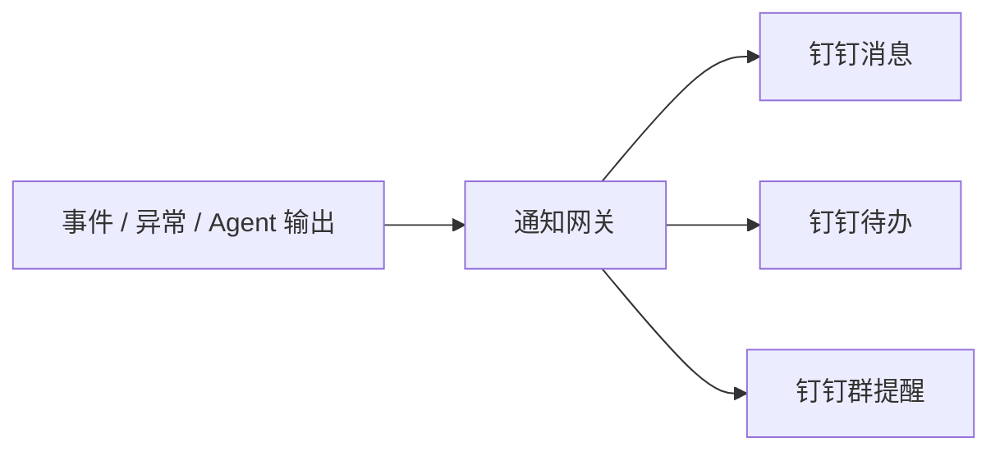

# 钉钉通知与待办设计

## 1. 文档目的

本文档用于定义 AtlasTradeAI 与钉钉之间的通知、提醒和待办设计思路。

## 2. 钉钉在本项目中的定位

钉钉在本项目中应被定位为：

- 消息触达通道
- 审批触达入口
- 待办通知入口
- 协同沟通渠道

不应被定位为：

- 核心业务主数据系统
- 订单状态主系统
- 任务主系统

## 3. 触达场景分类

建议优先支持以下触达场景：

- 新任务创建提醒
- 高优先级异常提醒
- 订单延期风险提醒
- 发货关键节点提醒
- 回款临期提醒
- 回款逾期提醒

## 4. 通知链路

## 5. 通知消息结构建议

建议消息至少包含：

- 标题
- 业务对象
- 风险等级
- 当前状态
- 建议动作
- 责任人
- 截止时间

## 6. 通知优先级建议

建议按四级进行控制：

- P1：立即通知
- P2：高优先提醒
- P3：普通提醒
- P4：汇总提醒

## 7. 待办设计建议

建议将以下任务推送为待办：

- 跟单任务
- 异常处理任务
- 单证补齐任务
- 回款跟进任务

## 8. 通知降噪原则

为了避免消息轰炸，建议遵循以下原则：

- 同一订单同一异常短时间不重复推送
- 低优先级事件可汇总发送
- 只有关键节点进入个人待办
- 普通信息进入群提醒或摘要

## 9. 与跟单员 Agent 的关系

跟单员 Agent 第一阶段的重要输出之一，就是生成可触达的钉钉提醒内容。

建议输出：

- 订单摘要
- 风险判断
- 建议动作
- 任务链接或对象编号

## 10. 文档结论

钉钉设计的关键，不是“什么都往钉钉发”，而是把最需要人及时响应的信息准确触达给正确的人。
