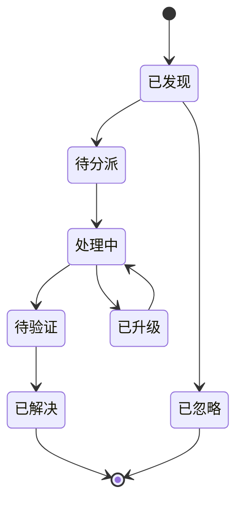
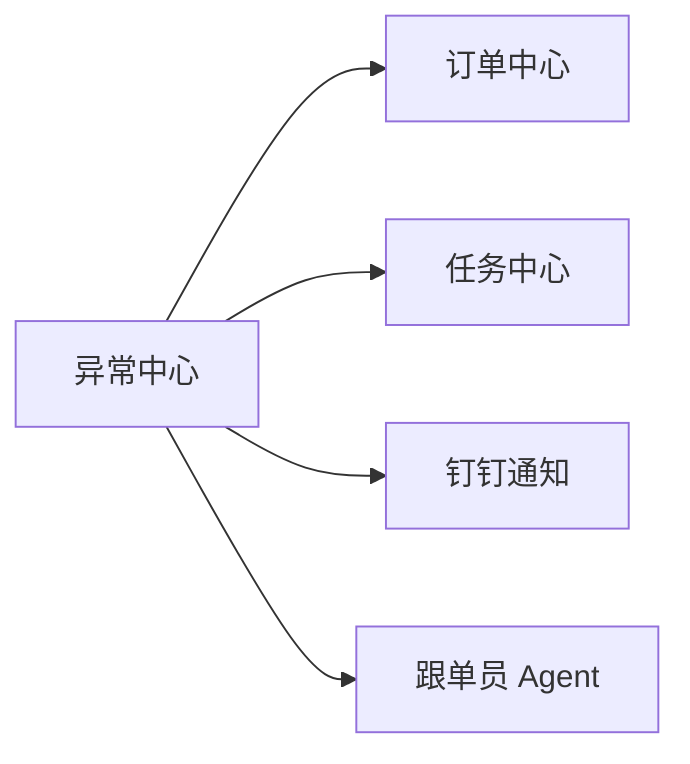

# 异常中心设计

## 1. 文档目的

本文档用于定义 AtlasTradeAI 中异常中心（Exception Center）的设计思路。

异常中心是连接流程、任务、通知和 Agent 的关键模块，用于把分散的问题转化为可追踪、可分派、可升级的业务异常对象。

## 2. 为什么异常中心必须单独设计

在贸易公司中，真正消耗管理成本的，往往不是正常流程，而是异常流程。

例如：

- 生产延期
- 单证缺失
- 报关被退单
- 物流延误
- 客户拒收
- 回款逾期

如果异常只是散落在聊天、表格和口头沟通里，系统就无法真正承担经营控制职责。

## 3. 异常中心定位

异常中心的定位是：

- 统一异常登记台账
- 异常分级与分类中心
- 异常处理流程入口
- 异常升级与提醒中心
- Agent 风险触发中心

## 4. 异常类型建议

建议至少分为以下类型：

- 订单异常
- 交付异常
- 质量异常
- 单证异常
- 报关异常
- 物流异常
- 结算异常
- 回款异常
- 客户异常

## 5. 异常等级建议

建议采用三级或四级分类。

例如：

- P1 严重异常
- P2 高优先异常
- P3 一般异常
- P4 提醒级异常

判断维度包括：

- 是否影响交期
- 是否影响发货
- 是否影响回款
- 是否影响重要客户
- 是否影响金额较大

## 6. 异常对象字段建议

每条异常建议包含：

- 异常编号
- 异常类型
- 异常等级
- 关联订单
- 关联客户
- 来源事件
- 当前责任人
- 发现时间
- 预计恢复时间
- 当前状态
- 处理建议
- 处理记录

## 7. 异常生命周期

建议异常中心采用独立状态机。

## 8. 异常来源

异常来源建议包括：

- 规则引擎自动识别
- 事件模型自动转换
- 人工创建
- Agent 自动标记
- 系统对账发现

## 9. 异常与订单、任务、通知的关系

异常中心的作用不是单纯记录，而是要：

- 回写订单风险等级
- 生成处理任务
- 推送给责任人
- 作为 Agent 的重点关注对象

## 10. 第一阶段建议优先纳入的异常

建议第一阶段先覆盖以下高价值异常：

- 生产延期异常
- 单证缺失异常
- 报关异常
- 物流延误异常
- 回款逾期异常

## 11. 与跟单员 Agent 的协作方式

跟单员 Agent 应重点消费两类输入：

- 新发现异常
- 长时间未解决异常

并输出：

- 异常摘要
- 跟进建议
- 升级建议
- 责任人提醒

## 12. 文档结论

异常中心是 AtlasTradeAI 从“流程记录系统”走向“经营控制系统”的关键模块。

没有异常中心，事件和任务会变散；有了异常中心，系统才能真正围绕问题推进处理。
