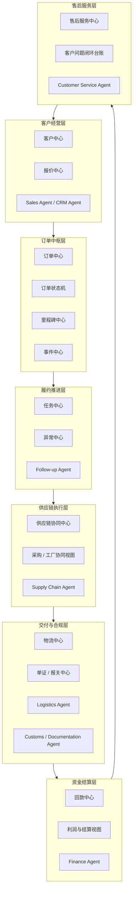
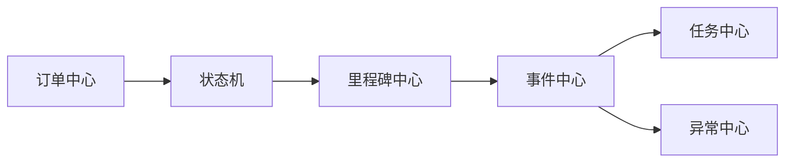

# “一个中枢 + 六层能力”模块映射表

## 1. 文档目的

本文档用于把《智能贸易操作系统角色分层与中枢架构设计》中提出的“一个中枢 + 六层能力”结构，进一步映射到可实施的系统模块层。

本文档重点回答：

- 每一层能力由哪些系统模块承载
- 每一层的核心对象是什么
- 每一层的主要输入输出是什么
- Agent 与系统模块之间如何对应

## 2. 设计原则

模块映射建议遵循以下原则：

- 层是业务能力分区，模块是系统承载单元
- 同一层可以对应多个模块
- 同一层中的 Agent 不等于模块本身
- 模块需要围绕订单中枢和统一事件机制协同

## 3. 总体映射图

## 4. 中枢与六层能力模块映射表

| 层级 | 业务目标 | 建议模块 | 核心对象 | 对应 Agent | 主要输出 |
| --- | --- | --- | --- | --- | --- |
| 客户经营层 | 客户经营、报价、成交 | 客户中心、报价中心 | 客户、联系人、报价 | Sales Agent、CRM Agent | 报价、客户画像、订单机会 |
| 订单中枢层 | 生命周期控制、状态流转 | 订单中心、状态机、里程碑中心、事件中心 | 订单、订单行、里程碑、事件 | Order Core / Order Orchestrator | 订单状态、标准事件、流程触发 |
| 履约推进层 | 跟单推进、异常升级 | 任务中心、异常中心、跟单工作台 | 任务、异常、订单关注项 | Follow-up Agent | 跟进任务、异常标记、催办提醒 |
| 供应链执行层 | 采购、排产、工厂协同 | 供应链协同中心、采购/工厂视图 | 采购单、排产状态、供应计划 | Supply Chain Agent | 生产进度、供应风险、执行反馈 |
| 交付与合规层 | 发货、物流、报关、单证 | 物流中心、单证/报关中心 | 发货单、物流节点、单证、报关状态 | Logistics Agent、Customs/Documentation Agent | 发货状态、物流状态、报关状态 |
| 资金结算层 | 应收、回款、利润、结算 | 回款中心、利润与结算视图 | 应收、回款记录、利润项 | Finance Agent | 回款状态、账龄风险、利润分析 |
| 售后服务层 | 投诉处理、售后闭环、客户维护 | 售后服务中心、问题闭环台账 | 售后工单、投诉、补发/赔付记录 | Customer Service Agent | 售后结果、客户反馈、复购输入 |

## 5. 各层详细模块说明

### 5.1 客户经营层

#### 建议模块

- 客户中心
- 报价中心

#### 模块职责

- 管理客户主档
- 管理联系人和客户关系
- 管理报价和报价版本
- 沉淀客户经营历史

#### 主要输入

- CRM 数据
- 邮件与沟通记录
- 销售录入信息

#### 主要输出

- 客户画像
- 报价记录
- 订单前置上下文
- 订单机会

### 5.2 订单中枢层

#### 建议模块

- 订单中心
- 订单状态机
- 里程碑中心
- 事件中心

#### 模块职责

- 建立统一订单主视图
- 管理订单生命周期
- 维护订单状态与子状态
- 记录和分发标准事件

#### 主要输入

- 客户经营层输出
- ERP 正式订单数据
- 履约阶段状态回传

#### 主要输出

- 订单状态变化
- 订单里程碑
- 标准事件
- 下游流程触发条件

### 5.3 履约推进层

#### 建议模块

- 任务中心
- 异常中心
- 跟单工作台

#### 模块职责

- 承接跟进动作
- 跟踪执行停滞
- 升级异常
- 给责任人生成任务和提醒

#### 主要输入

- 订单状态事件
- 供应链异常
- 物流异常
- 回款临期或逾期事件

#### 主要输出

- 跟进任务
- 异常记录
- 催办通知
- Agent 摘要

### 5.4 供应链执行层

#### 建议模块

- 供应链协同中心
- 采购 / 工厂协同视图

#### 模块职责

- 跟踪采购和供应计划
- 跟踪排产与工厂执行
- 反馈生产进度与异常

#### 主要输入

- 待执行订单
- 库存与采购状态
- 工厂反馈

#### 主要输出

- 生产进度
- 延期风险
- 发货准备状态

### 5.5 交付与合规层

#### 建议模块

- 物流中心
- 单证 / 报关中心

#### 模块职责

- 管理出库与发运
- 跟踪物流节点
- 管理报关资料
- 管理单证完整性和清关状态

#### 主要输入

- 发货准备完成的订单
- 物流服务商节点
- 单证资料
- 报关回执

#### 主要输出

- 物流状态
- 发货完成状态
- 报关 / 清关状态
- 合规异常

### 5.6 资金结算层

#### 建议模块

- 回款中心
- 利润与结算视图

#### 模块职责

- 跟踪应收与回款
- 支撑开票和对账视图
- 输出订单利润和账龄风险

#### 主要输入

- 发货 / 交付结果
- ERP 应收与回款数据
- 订单金额和成本信息

#### 主要输出

- 回款状态
- 逾期预警
- 利润视图

### 5.7 售后服务层

#### 建议模块

- 售后服务中心
- 客户问题闭环台账

#### 模块职责

- 记录投诉与售后问题
- 跟踪补发、赔付、退款处理
- 形成客户维护与复购输入

#### 主要输入

- 客户投诉
- 交付异常后续结果
- 售后工单

#### 主要输出

- 售后闭环结果
- 客户满意度反馈
- 客户维护输入

## 6. 订单中枢与模块承载关系

订单中枢不是单独某一个页面，而是一组核心模块的组合。

这意味着：

- 订单中心负责订单主视图
- 状态机负责控制逻辑
- 里程碑中心负责时间轴
- 事件中心负责驱动协同
- 任务与异常负责承接动作

## 7. Agent 与模块的映射关系

Agent 不是凭空工作的，而是附着在模块之上。

| Agent | 主要依赖模块 | 主要读取 | 主要输出到 |
| --- | --- | --- | --- |
| Sales Agent | 客户中心、报价中心 | 客户、报价、跟进记录 | 客户机会、报价建议 |
| CRM Agent | 客户中心 | 客户数据、跟进历史 | 客户分层、提醒建议 |
| Follow-up Agent | 订单中心、任务中心、异常中心 | 订单状态、里程碑、异常 | 跟进任务、异常标记、通知 |
| Supply Chain Agent | 供应链协同中心 | 订单、库存、排产、采购状态 | 生产进度、供应风险 |
| Logistics Agent | 物流中心 | 发货状态、物流节点 | 物流异常、到货反馈 |
| Customs / Documentation Agent | 单证/报关中心 | 单证、报关状态 | 报关异常、资料缺失提示 |
| Finance Agent | 回款中心、利润视图 | 应收、回款、利润项 | 回款预警、利润分析 |
| Customer Service Agent | 售后服务中心 | 售后工单、客户反馈 | 问题闭环、维护建议 |

## 8. 第一阶段模块优先级建议

如果从第一阶段落地角度看，建议优先建设：

### 8.1 P0 模块

- 订单中心
- 状态机
- 里程碑中心
- 事件中心
- 任务中心
- 异常中心

### 8.2 P1 模块

- 客户中心
- 回款中心
- 供应链协同中心

### 8.3 P2 模块

- 物流中心
- 单证 / 报关中心
- 售后服务中心

## 9. 文档结论

“一个中枢 + 六层能力”的正确落地方式，不是把每一层都简单实现成一个独立系统，而是：

- 用模块承载能力层
- 用订单中枢控制生命周期
- 用事件中心驱动协同
- 用 Agent 在模块之上承担智能角色

这份模块映射表，是后续产品拆分、服务拆分和实现排期的重要依据。
