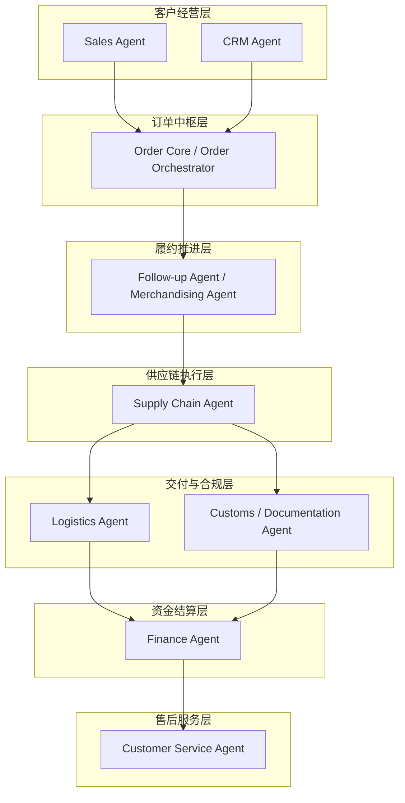
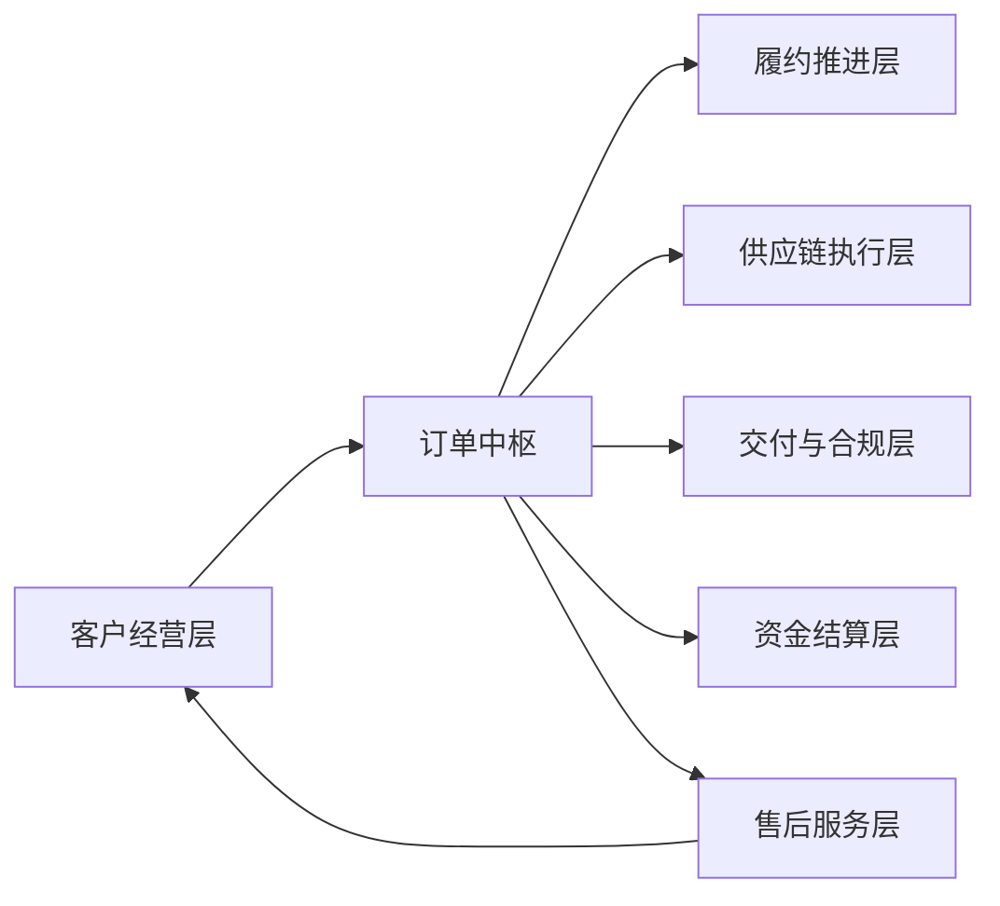
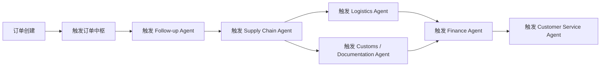

# 智能贸易操作系统角色分层与中枢架构设计

## 1. 文档目的

本文档用于正式定义 AtlasTradeAI 的角色分层结构与系统中枢架构。

这份文档要解决的核心问题是：

- 这个系统到底是不是多个 Agent 的拼接
- 各层能力如何划分
- 订单在整个系统中处于什么位置
- 不同业务角色 Agent 与系统模块之间如何协同

## 2. 核心结论

AtlasTradeAI 不是多个独立 Agent 的拼接系统，而是一个：

以订单为核心、以事件为驱动、以流程自动流转为机制、以多个业务角色 Agent 为执行节点的智能贸易操作系统。

因此，这个系统的本质不是“多个 Agent 并列协作”，而是：

- 一个订单中枢
- 六层业务能力
- 多个角色型 Agent 嵌入其中
- 由统一事件系统驱动全流程流转

## 3. 总体架构判断

在这个系统中，最重要的设计原则是：

- 订单是核心对象
- 订单状态流转是控制主线
- 事件机制是驱动力
- Agent 是业务执行与增强节点
- 模块与 Agent 都围绕订单中枢协同

因此，系统设计不能从“Agent 列表”出发，而应从“订单生命周期”出发。

## 4. 一个中枢 + 六层能力

推荐采用以下结构：

- 一个中枢：订单中枢层
- 六层能力：客户经营层、履约推进层、供应链执行层、交付与合规层、资金结算层、售后服务层

## 5. 为什么必须有订单中枢

在贸易型公司中，客户、报价、生产、物流、报关、回款这些环节虽然各自独立，但真正把它们串起来的核心对象不是客户，也不是产品，而是订单。

订单中枢层应承担以下职责：

- 维护订单主数据
- 维护订单状态机
- 维护订单里程碑
- 触发后续事件与流程
- 聚合全链路执行状态
- 作为其他 Agent 的协同中心

因此，订单中枢并不等同于一个普通 Agent，而更接近：

- 业务编排器
- 生命周期控制器
- 流程中枢

## 6. 六层业务能力说明

### 6.1 客户经营层

这一层负责订单生成之前的客户经营和成交动作。

建议包含：

- `Sales Agent`
- `CRM Agent`

其中：

- `Sales Agent` 更偏客户开发、报价、成交、规格协商
- `CRM Agent` 更偏客户沉淀、客户分层、画像分析、跟进提醒

这一层的目标，是把客户需求转化为结构化订单机会。

### 6.2 履约推进层

这一层由 `Follow-up Agent` 主导，是整个系统最重要的推进层之一。

它的职责不是生成订单，而是围绕订单进行全流程跟进。

典型职责包括：

- 跟踪订单状态
- 识别流程停滞
- 监督排期和异常
- 推动各责任方处理问题
- 生成跟进任务和提醒

这一层的本质，是把系统从“记录型系统”变成“推进型系统”。

### 6.3 供应链执行层

这一层用于承接订单正式执行后的供应链与工厂协同。

第一阶段建议使用一个合并的：

- `Supply Chain Agent`

其职责包括：

- 工厂协同
- 供应商管理
- 生产进度跟踪
- 部分采购协同
- 排期协调

后续复杂度上升后，可进一步拆分为：

- `Procurement Agent`
- `Factory Agent`

### 6.4 交付与合规层

这一层主要负责履约后段的发运与外贸合规。

建议包含两个角色：

- `Logistics Agent`
- `Customs / Documentation Agent`

其中：

- `Logistics Agent` 负责发货安排、物流跟踪、仓配协同
- `Customs / Documentation Agent` 负责单证、报关、清关、合规校验

注意：

这一层不建议使用 `Customer Agent` 命名，因为容易与客户管理混淆。

### 6.5 资金结算层

这一层由 `Finance Agent` 主导。

主要职责包括：

- 应收应付管理
- 开票与对账支持
- 回款跟踪
- 订单利润核算
- 财务风险识别

这一层不是主流程起点，但它是经营闭环的关键层。

### 6.6 售后服务层

这一层由 `Customer Service Agent` 主导。

主要职责包括：

- 售后支持
- 投诉处理
- 问题闭环
- 客户维护
- 复购支持输入

这一层是经营闭环的最后一层，也是再次进入客户经营层的重要回流入口。

## 7. 订单中枢与各层能力的关系

订单中枢不是简单的其中一层，而是系统中真正的中控点。

这个关系意味着：

- 客户经营层负责把机会变成订单
- 订单中枢接管整个生命周期
- 其余各层围绕订单中枢分阶段协同
- 售后结果又会回流到客户经营层，形成闭环

## 8. Agent、模块、层三者的区别

在系统设计中，必须严格区分三个概念：

### 8.1 层

层是业务能力分区，例如：

- 客户经营层
- 供应链执行层
- 资金结算层

### 8.2 模块

模块是系统实现单元，例如：

- 客户中心
- 订单中心
- 任务中心
- 异常中心
- 回款中心

### 8.3 Agent

Agent 是承担业务角色与智能处理职责的执行节点，例如：

- Sales Agent
- Follow-up Agent
- Finance Agent

这三者不能混为一谈。

正确的理解应是：

- 层定义业务边界
- 模块承载系统功能
- Agent 负责在层和模块之上进行智能决策与执行增强

## 9. 事件驱动的全流程流转逻辑

这个系统最重要的不是“有多少 Agent”，而是“事件如何推动整个流程自动流转”。

上图表达的是主干事件流，而不是绝对线性流程。  
实际运行中，它更像是一个由状态和事件驱动的动态协同网络。

## 10. 为什么这个系统不是多个独立模块

如果按传统方式拆成：

- 销售模块
- 订单模块
- 工厂模块
- 物流模块
- 财务模块

那么很容易产生两个问题：

- 各模块只负责记录自己的数据，不负责推动全局流转
- 模块之间靠人工协调，不能形成自动闭环

而 AtlasTradeAI 的目标，是建立一个自动流转系统，因此：

- 订单中枢必须掌握全局状态
- 事件机制必须触发后续动作
- Follow-up Agent 必须承担推进职责
- 任务中心和异常中心必须贯穿全链路

## 11. 第一阶段建议采用的正式表达

如果要对团队、投资人、业务负责人或者技术团队正式描述系统，可以使用以下表述：

AtlasTradeAI 不是一个由多个独立 Agent 拼接而成的系统，而是一个以订单为中枢、以事件为驱动、以自动流转为目标的智能贸易操作系统。

在这个系统中：

- 客户经营层负责成交前经营
- 订单中枢负责生命周期控制
- 履约推进层负责全链路跟进
- 供应链执行层负责生产和供应协同
- 交付与合规层负责发货与报关
- 资金结算层负责应收回款与利润
- 售后服务层负责售后与客户维护

## 12. 第一阶段架构落地建议

从实施角度看，第一阶段不需要把所有层都做成成熟智能体。

建议优先落地：

- 订单中枢
- Follow-up Agent
- Supply Chain 的基础协同能力
- Logistics / Customs 的状态接入能力
- Finance 的回款状态能力

也就是说，第一阶段重点不是“把所有角色都 AI 化”，而是先把中枢和流转机制建立起来。

## 13. 文档结论

AtlasTradeAI 的本质，是一个订单驱动的智能贸易操作系统。

它的正确结构不是多个独立 Agent 的并列拼接，而是：

- 一个订单中枢
- 六层业务能力
- 多个角色 Agent 嵌入业务层
- 由统一事件系统驱动自动流转

这个结构将成为后续模块设计、Agent 设计和系统实现的上层定义。
