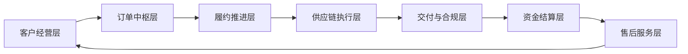
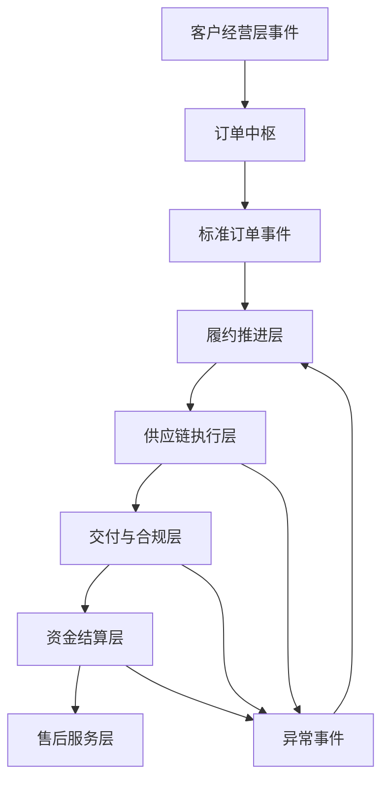

# 各层之间的事件触发矩阵

## 1. 文档目的

本文档用于定义“一个中枢 + 六层能力”之间的主要事件触发关系。

本文档重点回答：

- 哪一层会触发哪一层
- 触发依据是什么
- 触发后应生成什么动作
- 后续模块与 Agent 应如何订阅这些事件

## 2. 设计原则

事件触发矩阵建议遵循以下原则：

- 以订单生命周期为主线
- 由订单中枢控制主干事件
- 各层之间通过标准事件协同
- 事件不是目的，任务、异常、通知才是落点

## 3. 总体触发关系图

这是一条主干事件流。  
但实际系统中，很多层之间也会发生跨层回触和并行触发。

## 4. 主干事件触发矩阵

| 触发层 | 触发事件 | 目标层 | 触发条件 | 目标动作 | 主要落点 |
| --- | --- | --- | --- | --- | --- |
| 客户经营层 | `quotation.accepted` | 订单中枢层 | 客户接受报价 | 创建订单草稿或订单记录 | 订单中心 |
| 客户经营层 | `order.confirm_request` | 订单中枢层 | 销售确认成交意向 | 进入待确认订单流转 | 状态机 |
| 订单中枢层 | `order.confirmed` | 履约推进层 | 订单正式确认 | 创建跟进任务、启动跟单 | 任务中心、Follow-up Agent |
| 履约推进层 | `followup.execution_started` | 供应链执行层 | 跟单接管订单 | 发起排产/采购/供应准备 | 供应链协同中心 |
| 供应链执行层 | `shipment.ready` | 交付与合规层 | 订单具备发货条件 | 启动发货、物流、单证、报关 | 物流中心、单证中心 |
| 交付与合规层 | `delivery.completed` | 资金结算层 | 货物交付完成 | 启动对账、开票、回款跟踪 | 回款中心 |
| 资金结算层 | `payment.completed` | 售后服务层 | 订单主要回款完成 | 关闭主交易链，转售后维护 | 售后服务中心 |
| 售后服务层 | `after_sales.closed` | 客户经营层 | 售后闭环完成 | 回流客户经营、沉淀复购机会 | 客户中心 |

## 5. 跨层异常触发矩阵

除了主干流转，还存在大量异常触发。

| 触发层 | 异常事件 | 目标层 | 处理目标 | 输出动作 |
| --- | --- | --- | --- | --- |
| 供应链执行层 | `production.milestone_delayed` | 履约推进层 | 跟单介入催办 | 创建任务、标记异常、通知 |
| 供应链执行层 | `material.shortage` | 履约推进层 | 跟单与采购协同处理 | 创建任务、升级风险 |
| 交付与合规层 | `document.missing` | 履约推进层 | 防止发货阻塞 | 创建单证补齐任务 |
| 交付与合规层 | `customs.rejected` | 履约推进层 | 触发报关异常处理 | 标记异常、通知负责人 |
| 交付与合规层 | `logistics.delayed` | 履约推进层 | 评估交付承诺风险 | 跟进任务、客户同步建议 |
| 资金结算层 | `payment.due_soon` | 履约推进层 | 提前催收准备 | 回款提醒任务 |
| 资金结算层 | `payment.overdue` | 履约推进层 | 升级资金风险 | 回款异常、销售/财务提醒 |
| 售后服务层 | `after_sales.complaint_created` | 客户经营层 | 更新客户风险和维护策略 | 客户维护提醒 |

## 6. 中枢控制下的事件流转图

这个图表达的是：

- 主干事件由订单中枢控制
- 异常事件会回流到履约推进层处理
- Follow-up Agent 是很多异常触发的第一承接者

## 7. 层与 Agent 的订阅关系建议

### 7.1 客户经营层订阅事件

- `after_sales.closed`
- `customer.level_changed`
- `payment.overdue`

### 7.2 订单中枢层订阅事件

- `quotation.accepted`
- `order.confirm_request`
- `order.updated`

### 7.3 履约推进层订阅事件

- `order.confirmed`
- `production.milestone_delayed`
- `document.missing`
- `logistics.delayed`
- `payment.due_soon`
- `payment.overdue`

### 7.4 供应链执行层订阅事件

- `followup.execution_started`
- `order.execution_ready`

### 7.5 交付与合规层订阅事件

- `shipment.ready`
- `production.completed`

### 7.6 资金结算层订阅事件

- `delivery.completed`
- `invoice.pending`

### 7.7 售后服务层订阅事件

- `payment.completed`
- `delivery.issue_confirmed`

## 8. 事件到动作的落点矩阵

事件本身最终应落到系统动作上。

| 事件类型 | 任务中心 | 异常中心 | 通知中心 | Agent |
| --- | --- | --- | --- | --- |
| `order.confirmed` | 创建跟单任务 | 否 | 是 | Follow-up Agent |
| `production.milestone_delayed` | 是 | 是 | 是 | Follow-up Agent |
| `document.missing` | 是 | 是 | 是 | Follow-up Agent / Customs Agent |
| `logistics.delayed` | 是 | 是 | 是 | Follow-up Agent / Logistics Agent |
| `payment.due_soon` | 是 | 否 | 是 | Finance Agent / Follow-up Agent |
| `payment.overdue` | 是 | 是 | 是 | Finance Agent / Follow-up Agent |
| `after_sales.complaint_created` | 是 | 是 | 是 | Customer Service Agent |

## 9. 第一阶段建议优先实现的事件链

为了控制范围，建议第一阶段先实现以下几条核心事件链：

### 9.1 订单确认链

- `quotation.accepted`
- `order.confirmed`
- 创建跟单任务

### 9.2 生产延期链

- `production.milestone_delayed`
- 标记交付异常
- 创建催办任务
- 触发跟单员 Agent

### 9.3 发货阻塞链

- `document.missing`
- 标记单证异常
- 创建补齐任务
- 通知相关责任人

### 9.4 回款风险链

- `payment.due_soon`
- `payment.overdue`
- 创建回款跟进任务
- 通知销售与财务

## 10. 实施建议

后续实现时，不建议一开始把所有层全部强耦合串起来，而建议：

- 先定义标准事件目录
- 先实现关键事件的统一结构
- 先打通订单中枢 -> 履约推进层的主链
- 再逐步扩展到供应链、物流、财务和售后

## 11. 文档结论

“一个中枢 + 六层能力”只有在事件关系被定义清楚之后，才能真正落到实现层。

这份事件触发矩阵的价值，就在于把上层架构中的层关系，进一步转化为：

- 事件关系
- 触发条件
- 系统动作
- Agent 订阅逻辑

它将成为后续流程引擎、事件总线和跟单员 Agent 持续实现的重要依据。
