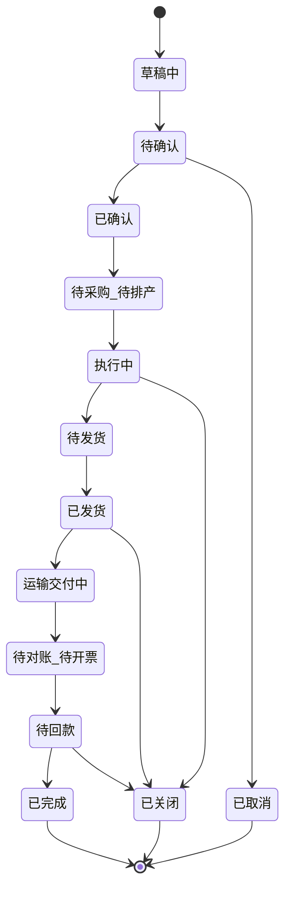
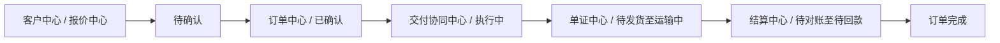

# 订单状态机设计

## 1. 文档目的

本文档用于定义 AtlasTradeAI 中订单（Order）的统一状态机，用于支撑：

- 跨系统订单主视图
- 流程推进与节点控制
- 事件驱动触发
- 跟单员 Agent 的上下文判断
- 异常识别与任务生成

订单状态机是整个系统运行的核心骨架之一。

## 2. 设计原则

订单状态机设计应遵循以下原则：

- 以订单生命周期为主线
- 兼容内销与外贸
- 状态数量适中，避免过细导致维护困难
- 支持里程碑、任务、异常和事件的挂载
- 允许在主状态下设置子状态或扩展状态

## 3. 订单状态机总体结构

建议将订单分为三层状态：

- 主状态
- 阶段子状态
- 风险与异常标记

其中：

- 主状态用于表达订单当前处于哪个核心阶段
- 子状态用于表达阶段内部更细的执行节点
- 风险与异常标记不直接替代状态，而是附着在状态之上

## 4. 推荐主状态

统一主状态建议如下：

- 草稿中
- 待确认
- 已确认
- 待采购 / 待排产
- 执行中
- 待发货
- 已发货
- 运输 / 交付中
- 待对账 / 待开票
- 待回款
- 已完成
- 已关闭
- 已取消

## 5. 推荐子状态

### 5.1 前置阶段子状态

- 报价中
- 样品中
- 客户确认中
- 合同确认中

### 5.2 供货阶段子状态

- 待采购
- 采购中
- 待排产
- 生产中
- 待验货
- 验货中

### 5.3 发货阶段子状态

- 待备货
- 待出库
- 待订舱
- 待单证
- 待报关
- 待装运

### 5.4 结算阶段子状态

- 待签收
- 待对账
- 待开票
- 待回款
- 部分回款
- 全额回款

## 6. 状态流转图

## 7. 状态定义说明

### 7.1 草稿中

定义：

订单尚处于销售录入、整理或待内部确认阶段，还未形成正式执行对象。

典型来源：

- CRM 商机转订单草稿
- 手工导入订单初稿

### 7.2 待确认

定义：

订单关键信息已经形成，但尚未完成内部评审或客户最终确认。

关键检查项：

- 客户信息是否完整
- 产品信息是否完整
- 价格是否确认
- 交期是否确认
- 付款条件是否确认

### 7.3 已确认

定义：

订单已经被业务确认并可进入正式履约流程。

通常意味着：

- 订单具备正式执行资格
- 可以进入 ERP 落账或正式执行单据生成

### 7.4 待采购 / 待排产

定义：

订单已确认，但尚未完成供货准备。

典型动作：

- 判断库存是否满足
- 发起采购
- 发起排产
- 评估供应能力

### 7.5 执行中

定义：

订单已进入实质履约执行阶段。

典型动作：

- 采购执行
- 生产执行
- 验货准备
- 异常处理

### 7.6 待发货

定义：

订单供货准备已接近完成，进入发货前准备阶段。

典型动作：

- 备货
- 出库准备
- 单证准备
- 订舱或物流安排

### 7.7 已发货

定义：

订单已经完成发货或出库动作。

关注重点：

- 是否有物流单号
- 是否有发货单据
- 是否已同步客户

### 7.8 运输 / 交付中

定义：

货物在途或交付过程中，尚未完成签收或最终交付确认。

关注重点：

- 国内签收节点
- 国际物流节点
- 报关及清关状态

### 7.9 待对账 / 待开票

定义：

订单已完成实物交付，开始进入结算前置阶段。

关注重点：

- 是否完成签收
- 是否完成对账
- 是否需要开票

### 7.10 待回款

定义：

订单已进入应收管理阶段，等待客户付款。

关注重点：

- 回款计划
- 账期
- 逾期风险

### 7.11 已完成

定义：

订单全流程完成，且主要回款责任已关闭。

### 7.12 已关闭

定义：

订单因业务特殊原因被关闭，但不一定是标准完成。

例如：

- 终止执行
- 客户放弃尾款
- 售后结案后关闭

### 7.13 已取消

定义：

订单在进入正式履约前已被取消。

## 8. 订单状态与系统模块的关系

状态机会决定：

- 哪个模块是当前主责任模块
- 哪类任务应该被创建
- 哪些事件应当触发
- 跟单员 Agent 该关注什么

## 9. 状态与任务机制的关系

每个主状态建议自动挂接一组标准任务模板。

例如：

- 待确认
  - 审核交期
  - 审核价格
  - 审核付款条件
- 执行中
  - 跟踪采购
  - 跟踪排产
  - 跟踪验货
- 待发货
  - 检查物流安排
  - 检查单证准备
  - 检查出库计划
- 待回款
  - 跟踪账期
  - 催收提醒
  - 回款登记

## 10. 状态与事件机制的关系

订单状态变化本身就是一类关键事件。

建议输出的状态变更事件包括：

- order.created
- order.confirmed
- order.procurement_started
- order.production_started
- order.ready_to_ship
- order.shipped
- order.in_transit
- order.delivered
- order.invoice_pending
- order.payment_pending
- order.completed
- order.cancelled

这些事件会驱动：

- 任务创建
- 异常识别
- 通知发送
- Agent 触发

## 11. 外贸与内销的状态兼容方式

建议采用统一主状态 + 扩展子状态的方式兼容。

例如：

- 外贸订单在“待发货”下可扩展：
  - 待订舱
  - 待报关
  - 待单证
- 内销订单在“待发货”下可扩展：
  - 待出库
  - 待配送
  - 待签收

这样既保留统一主干，也允许差异化执行。

## 12. 跟单员 Agent 在状态机中的作用

跟单员 Agent 不负责改变订单状态，但负责围绕状态机做四件事：

- 识别状态停滞
- 识别状态跳变异常
- 识别状态对应任务是否超时
- 为状态推进生成建议

例如：

- 订单长期停留在“待发货”
- 已发货但单证状态仍未完成
- 待回款状态逾期未推进

## 13. 实施建议

第一阶段实现时，建议先只落以下能力：

- 统一主状态
- 限定数量的关键子状态
- 状态变更事件
- 状态与任务模板绑定
- 状态超时提醒

不要一开始就把状态拆得过细，否则系统会变重且难以维护。

## 14. 文档结论

订单状态机是 AtlasTradeAI 中最核心的控制结构之一。

它既连接业务流程，也连接任务、异常、事件和智能体，是后续实现事件驱动跟单和流程自动化的基础。
