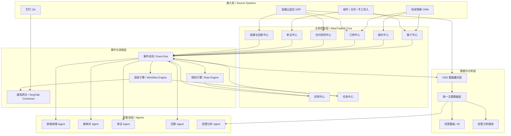
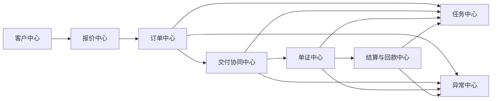
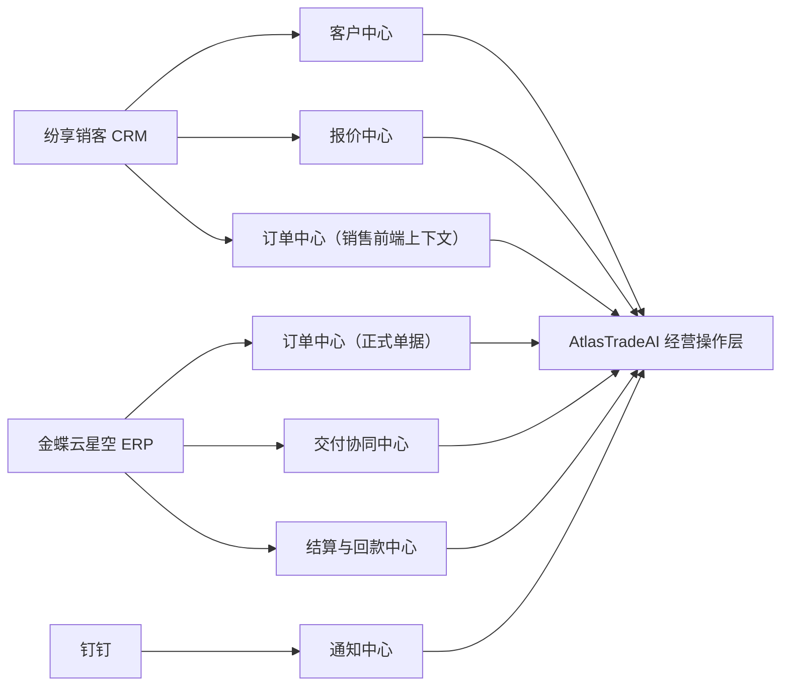
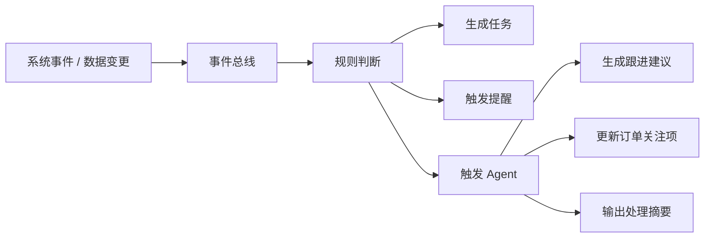

# 系统蓝图与模块衔接说明

## 1. 文档目的

本文档用于描述 AtlasTradeAI 的整体系统蓝图，包括现有系统、新建系统、核心模块、模块之间的衔接关系，以及分阶段实施路径。

本文档重点回答两个问题：

- 整个系统由哪些模块组成
- 各模块之间如何衔接与协同

## 2. 系统蓝图总览

从系统层次来看，整体架构建议分为五层：

- 接入层
- 业务控制层
- 事件与流程层
- 数据与分析层
- 智能体层

## 3. 模块分层说明

### 3.1 接入层

这一层负责与现有系统和外部输入源连接。

主要包括：

- 纷享销客 CRM
- 金蝶云星空 ERP
- 钉钉 OA
- 邮件、Excel、PDF、手工导入等外部输入

这层的主要价值是：

- 获取原始业务数据
- 获取变更事件
- 为新系统提供同步入口

### 3.2 业务控制层

这是 AtlasTradeAI 的核心操作层。

建议包含以下模块：

- 客户中心
- 报价中心
- 订单中心
- 交付协同中心
- 单证中心
- 结算与回款中心
- 任务中心
- 异常中心

这层的职责是：

- 维护统一业务主视图
- 控制业务状态推进
- 连接前台销售与后台履约
- 形成跨系统订单闭环

### 3.3 事件与流程层

这一层是未来自动化与 Agent 化能力的核心。

建议包含：

- 事件总线（Event Bus）
- 流程引擎（Workflow Engine）
- 规则引擎（Rule Engine）
- 通知网关（Notification Gateway）

这一层负责：

- 接收业务事件
- 判断触发规则
- 启动流程或任务
- 发送通知与提醒
- 为智能体提供触发入口

### 3.4 数据与分析层

这一层用于沉淀跨系统统一数据和管理分析能力。

建议包含：

- ODS 数据备份层
- 统一主题数据层
- 指标服务
- BI 看板
- 经营分析服务

这一层负责：

- 数据备份
- 数据口径统一
- 多系统数据关联
- 经营指标输出
- 为 Agent 提供上下文数据

### 3.5 智能体层

这一层不直接替代核心业务系统，而是作为增强层存在。

建议优先建设：

- 销售助理 Agent
- 跟单员 Agent
- 单证 Agent
- 回款 Agent
- 经营分析 Agent

## 4. 核心模块之间的衔接关系

如果从业务衔接角度看，核心模块可以抽象成以下关系：

这个关系可以理解为：

- 客户中心负责形成业务起点
- 报价中心承接销售机会并形成订单前置上下文
- 订单中心成为统一主轴
- 交付协同中心负责推动订单落地
- 单证中心负责外贸后半段材料与合规
- 结算与回款中心负责资金闭环
- 任务中心和异常中心贯穿整个链路

## 5. 模块与现有系统的映射关系

这个映射的核心原则是：

- CRM 负责前台销售经营过程
- ERP 负责正式业务数据与财务口径
- AtlasTradeAI 负责跨系统控制、聚合、提醒和智能化
- 钉钉负责触达，不负责主数据

## 6. 事件驱动架构在整体中的位置

未来的跟单动作不应依赖人工轮询，而应逐步转成事件驱动。

这意味着后续跟单员 Agent 的工作方式会是：

- 监听事件
- 判断是否需要跟进
- 结合上下文生成建议
- 创建任务或发出提醒

## 7. 分阶段实施蓝图

### 7.1 第一阶段：先建经营控制骨架

目标：

让业务主链可见、可追踪、可提醒。

建议建设：

- 客户中心主视图
- 订单中心主视图
- 交付协同中心
- 回款主视图
- 任务中心
- 异常中心
- ODS 数据备份层
- 基础 BI 看板
- 钉钉通知能力

### 7.2 第二阶段：建设流程和事件引擎

目标：

让系统开始主动推动业务，而不是只展示业务。

建议建设：

- 事件总线
- 流程引擎
- 规则引擎
- 统一事件模型
- 里程碑与 SLA 模型
- 自动提醒与催办机制

### 7.3 第三阶段：先落地基础跟单员 Agent

目标：

从“人工盯单”升级为“系统协助盯单”。

建议建设：

- 跟单员 Agent
- 跟单建议生成
- 延期风险识别
- 异常摘要生成
- 跟进任务自动创建

### 7.4 第四阶段：扩展多智能体协同

目标：

形成销售、单证、回款和经营分析的多 Agent 体系。

建议建设：

- 销售助理 Agent
- 单证 Agent
- 回款 Agent
- 经营分析 Agent
- Agent 间上下文共享能力

## 8. 当前最值得先做的模块

如果按投入产出比排序，建议优先从以下模块开始：

1. 订单中心
2. 交付协同中心
3. 任务中心
4. 异常中心
5. 数据备份层
6. 事件模型
7. 跟单员 Agent

原因是这几部分一旦建立起来，后续很多自动化能力就有了统一落点。

## 9. 文档结论

AtlasTradeAI 的正确架构方向，不是围绕单一系统做增强，而是：

在现有 CRM、ERP、OA 之上，建立一个以订单为核心、以事件为驱动、以任务和异常为抓手、以智能体为增强层的经营控制平台。

后续的实现工作，应围绕这个蓝图逐步把“可见”升级到“可管”，再从“可管”升级到“可智能协同”。
