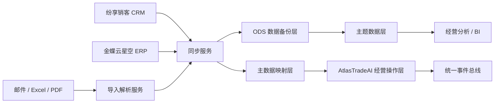
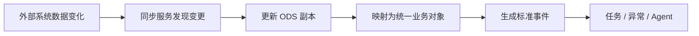

# 系统集成与数据同步架构设计

## 1. 文档目的

本文档用于定义 AtlasTradeAI 与现有系统之间的集成关系，以及跨系统数据同步、备份和对账的总体设计思路。

## 2. 集成设计目标

本项目的集成层要实现以下目标：

- 与现有 CRM、ERP、OA 共存
- 将关键数据同步到外部经营操作层
- 建立可分析、可追踪的数据副本
- 支撑事件触发、看板分析和 Agent 能力

## 3. 集成对象

当前重点集成对象包括：

- 纷享销客 CRM
- 金蝶云星空 ERP
- 钉钉
- 邮件与文件输入

## 4. 集成策略

### 4.1 对 CRM 的策略

建议采用：

- 关键字段同步
- 定时拉取为主
- 事件近似模拟为辅
- 不依赖其承载高实时流程

原因：

- 接口开放与实时性较弱
- 更适合作为前台来源系统

### 4.2 对 ERP 的策略

建议采用：

- 作为正式业务结果来源
- 关键单据和状态定时同步
- 对重要结果建立标准事件
- 作为财务与库存口径主源

### 4.3 对钉钉的策略

建议采用：

- 作为通知与审批触达接口
- 接收待办、提醒、异常消息
- 不作为核心业务数据源

## 5. 数据同步总体架构

## 6. 同步层建议拆分

建议同步层拆成以下几个部分：

- 数据采集器
- 字段映射器
- 主键关联器
- 变更检测器
- 标准事件转换器
- 同步日志与对账机制

## 7. 主数据映射设计

由于不同系统中的对象编码不一致，建议建立统一映射。

重点包括：

- 客户映射
- 联系人映射
- 产品 / SKU 映射
- 订单映射
- 单据映射

例如：

- CRM 客户 ID <-> AtlasTradeAI 客户 ID
- ERP 客户编码 <-> AtlasTradeAI 客户 ID
- CRM 订单号 <-> ERP 销售订单号 <-> AtlasTradeAI 订单 ID

## 8. 推荐同步的数据范围

### 8.1 从 CRM 同步

- 客户
- 联系人
- 商机 / 询盘
- 报价
- 跟进记录
- 订单前置上下文

### 8.2 从 ERP 同步

- 正式订单
- 采购单
- 库存可用量
- 出入库记录
- 发货记录
- 应收数据
- 开票数据
- 成本相关数据

### 8.3 从外部输入同步

- 邮件摘要
- 单证文件元数据
- Excel 导入数据
- 物流反馈数据

## 9. 同步频率建议

根据业务重要性建议分层处理。

### 9.1 高优先级同步

- 订单状态
- 发货状态
- 回款状态
- 异常状态

建议：

- 尽可能短周期同步
- 同步后生成标准事件

### 9.2 中优先级同步

- 客户资料
- 跟进记录
- 报价记录

建议：

- 定时拉取
- 以增量同步为主

### 9.3 低优先级同步

- 历史归档数据
- 统计分析补充数据

建议：

- 批量同步

## 10. 数据一致性策略

项目必须接受一个现实：

在多系统共存阶段，不可能所有系统实时强一致。

因此建议采用：

- 主源明确
- 副本可追踪
- 差异可发现
- 关键数据可人工校正

### 10.1 主源原则

- 客户前端跟进以 CRM 为主源
- 正式订单与财务口径以 ERP 为主源
- 任务、异常、事件以 AtlasTradeAI 为主源

### 10.2 差异处理原则

当系统间出现差异时：

- 优先记录差异
- 不直接覆盖高可信主源
- 生成差异任务或异常提示

## 11. 同步与事件的关系

同步不是为了备份而已，更重要的是输出事件。

## 12. 第一阶段实施建议

第一阶段建议优先做以下集成闭环：

- CRM 客户与订单前置信息同步
- ERP 正式订单与发货 / 回款同步
- 建立统一订单 ID 映射
- 建立 ODS 数据备份层
- 建立同步日志和失败重试机制

## 13. 文档结论

系统集成与数据同步层，是 AtlasTradeAI 能否建立统一主视图、统一事件机制和跟单员 Agent 的基础。

这一层不只是技术连接器，更是业务控制层与现有系统之间的桥梁。
