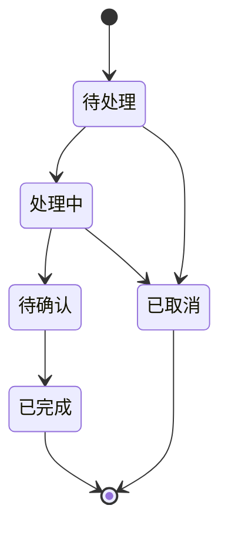
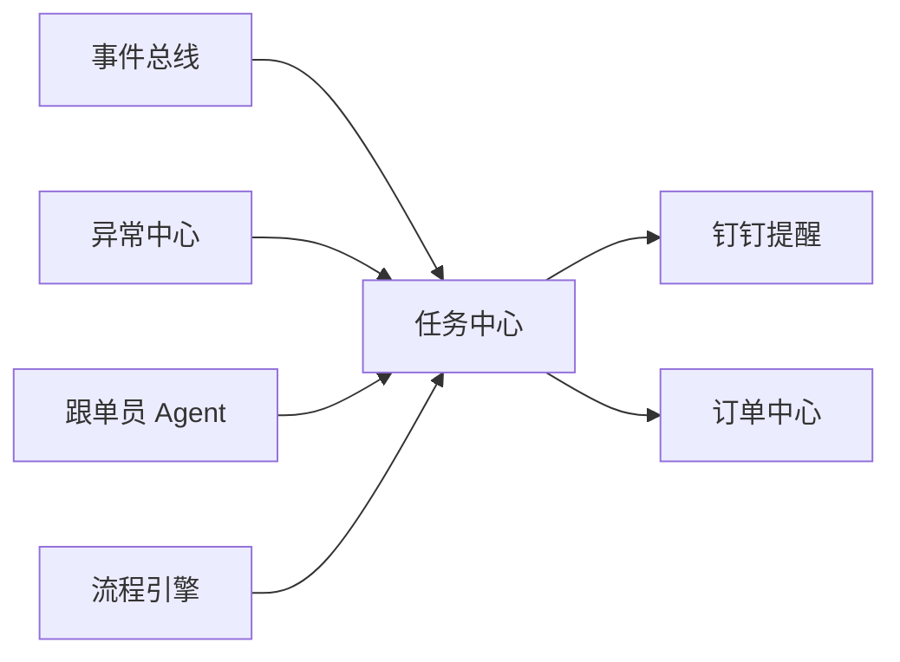

# 任务中心设计

## 1. 文档目的

本文档用于定义 AtlasTradeAI 中任务中心（Task Center）的设计思路。

任务中心的核心作用，是把事件、异常、流程和 Agent 输出转换成可执行、可追踪、可关闭的业务动作。

## 2. 任务中心定位

任务中心应承担以下角色：

- 系统统一待办池
- 跨模块动作承接层
- 订单推进抓手
- 异常处理承接层
- Agent 输出落点

## 3. 为什么任务中心重要

如果没有任务中心：

- 事件只会停留在消息层
- 异常只会停留在提醒层
- Agent 只能给建议，无法真正推动执行

任务中心的存在，是为了把“知道有问题”变成“有人去处理”。

## 4. 任务来源

任务建议有四类来源：

- 流程引擎自动创建
- 规则引擎自动创建
- Agent 自动创建
- 人工手动创建

## 5. 任务类型建议

第一阶段建议优先支持以下任务类型：

- 客户跟进任务
- 订单确认任务
- 采购跟进任务
- 生产跟进任务
- 单证补齐任务
- 发货确认任务
- 回款提醒任务
- 异常处理任务

## 6. 任务状态机

## 7. 任务核心字段建议

- `task_id`
- `task_type`
- `task_title`
- `task_description`
- `task_source`
- `related_order_id`
- `related_customer_id`
- `related_exception_id`
- `priority`
- `assignee_id`
- `due_time`
- `task_status`
- `created_by`
- `created_time`
- `completed_time`

## 8. 任务与其他模块的关系

## 9. 任务生成规则示例

例如：

- `production.milestone_delayed`
  - 生成“确认工厂恢复时间”任务
- `document.missing`
  - 生成“补齐单证资料”任务
- `payment.due_soon`
  - 生成“回款跟进”任务

## 10. 与跟单员 Agent 的关系

跟单员 Agent 的大部分输出，第一阶段都应落到任务中心。

它的典型动作包括：

- 创建跟进任务
- 更新任务优先级
- 为任务补充摘要

## 11. 第一阶段实施建议

第一阶段建议先做轻量任务中心，不必一开始就做复杂项目管理能力。

优先能力包括：

- 创建任务
- 指派责任人
- 设置优先级
- 设置到期时间
- 更新状态
- 推送钉钉提醒

## 12. 文档结论

任务中心是 AtlasTradeAI 中把“系统感知”转化为“业务动作”的关键模块。

后续无论是流程自动化还是 Agent 协同，最终都需要任务中心作为承接层。
