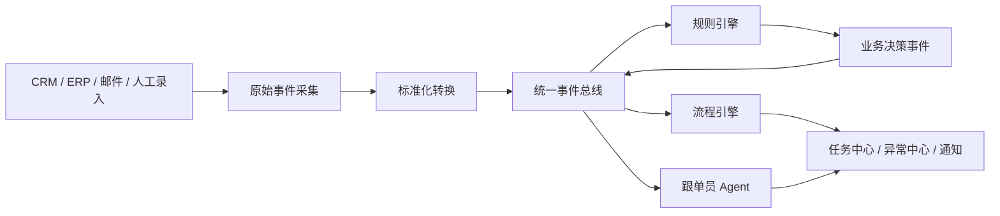
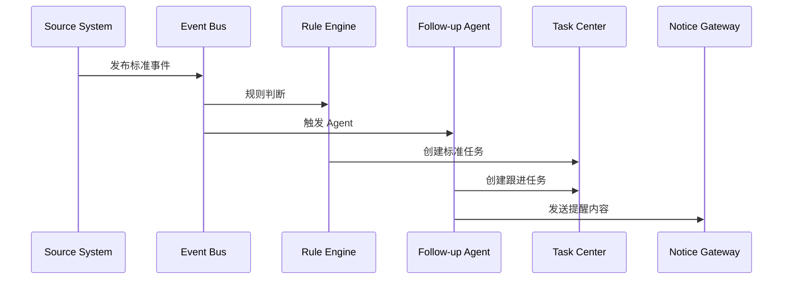

# 统一事件模型设计

## 1. 文档目的

本文档用于定义 AtlasTradeAI 的统一事件模型（Unified Event Model），用于支撑：

- 跨系统变更感知
- 流程触发
- 任务自动创建
- 异常识别
- 跟单员 Agent 触发
- 后续多智能体协同

## 2. 为什么必须统一事件模型

如果没有统一事件模型，系统会出现以下问题：

- 不同系统各自发消息，无法统一处理
- 相同业务变化在不同地方有不同命名
- Agent 很难稳定监听和判断
- 后续流程自动化逻辑会越来越混乱

因此，本项目必须建立一个跨 CRM、ERP、外部操作层的统一事件语言。

## 3. 事件模型设计原则

统一事件模型建议遵循以下原则：

- 事件命名统一
- 事件结构统一
- 事件来源可追溯
- 事件可重放
- 事件可被规则引擎和 Agent 直接消费
- 事件要同时兼顾业务可读性和技术可实现性

## 4. 统一事件结构

建议每个事件都包含以下核心字段。

### 4.1 基础字段

- `event_id`
- `event_type`
- `event_time`
- `source_system`
- `source_record_id`
- `biz_object_type`
- `biz_object_id`

### 4.2 业务上下文字段

- `customer_id`
- `order_id`
- `owner_id`
- `priority`
- `status_before`
- `status_after`
- `amount`
- `currency`

### 4.3 扩展字段

- `payload`
- `tags`
- `risk_level`
- `operator`
- `trace_id`

## 5. 事件分类体系

建议从业务语义上，把事件分为六大类。

### 5.1 客户与销售事件

例如：

- customer.created
- customer.updated
- inquiry.created
- quotation.sent
- quotation.accepted
- sample.requested
- sample.sent

### 5.2 订单事件

例如：

- order.created
- order.confirmed
- order.updated
- order.cancelled
- order.status_changed

### 5.3 供应链与履约事件

例如：

- procurement.created
- procurement.delayed
- production.started
- production.milestone_delayed
- quality.failed
- shipment.ready
- shipment.dispatched

### 5.4 单证与报关事件

例如：

- document.missing
- document.validated
- customs.submitted
- customs.rejected
- customs.cleared

### 5.5 物流事件

例如：

- logistics.booked
- logistics.in_transit
- logistics.delayed
- logistics.delivered

### 5.6 结算与回款事件

例如：

- invoice.created
- invoice.issued
- payment.due_soon
- payment.received
- payment.overdue
- reconciliation.exception_found

## 6. 事件层级设计

建议将事件分为三层：

- 原始事件
- 标准事件
- 业务决策事件

### 6.1 原始事件

来源于外部系统原始变更。

例如：

- CRM 某条订单记录变更
- ERP 某张出库单新增
- 钉钉审批状态更新

### 6.2 标准事件

将原始变化转换成 AtlasTradeAI 的统一业务事件。

例如：

- ERP 新增出库单 -> shipment.dispatched
- ERP 检测账期临近 -> payment.due_soon

### 6.3 业务决策事件

由规则引擎或 Agent 二次加工生成。

例如：

- followup.required
- risk.delivery_delay
- risk.payment_overdue
- escalation.customs_blocked

## 7. 事件流转图

## 8. 第一阶段建议优先支持的事件

为了控制范围，第一阶段不需要把所有事件一次性做完。

建议优先支持以下事件：

- order.confirmed
- order.status_changed
- production.milestone_delayed
- shipment.ready
- shipment.dispatched
- document.missing
- customs.rejected
- logistics.delayed
- payment.due_soon
- payment.overdue

这些事件已经足以支撑跟单员 Agent 的基础能力。

## 9. 事件与任务的关系

事件不是目的，任务才是推进业务的抓手。

建议建立事件到任务的标准映射，例如：

- production.milestone_delayed
  - 创建“确认生产恢复时间”任务
- document.missing
  - 创建“补齐单证资料”任务
- payment.due_soon
  - 创建“回款提醒”任务
- logistics.delayed
  - 创建“确认物流异常原因”任务

## 10. 事件与异常的关系

并不是所有事件都构成异常，但部分事件应该自动转成异常记录。

例如：

- customs.rejected -> 报关异常
- payment.overdue -> 回款异常
- production.milestone_delayed -> 交付异常
- quality.failed -> 质量异常

## 11. 事件与跟单员 Agent 的关系

跟单员 Agent 最重要的触发来源就是统一事件总线。

Agent 消费事件时建议采用以下逻辑：

- 先判断事件类型是否在关注范围内
- 再加载订单与客户上下文
- 再判断是否生成任务、提醒或摘要

## 12. 事件命名规范建议

建议统一采用：

`对象.动作`

例如：

- order.confirmed
- shipment.dispatched
- payment.received

对于风险与决策事件，可采用：

`risk.对象_风险`
`followup.动作`
`escalation.动作`

例如：

- risk.delivery_delay
- followup.required
- escalation.payment_overdue

## 13. 事件落地建议

第一阶段不必追求复杂技术实现，但需要先统一业务设计。

建议第一阶段先做：

- 统一事件目录
- 统一事件字段结构
- 关键事件的标准化转换
- 事件到任务 / 异常 / 通知的映射表

后续再考虑更复杂的事件订阅、重放、幂等和审计机制。

## 14. 文档结论

统一事件模型是 AtlasTradeAI 的流程自动化底座。

它会把来自不同系统的变化，转化为统一、可理解、可消费的业务语言，从而让任务中心、异常中心和跟单员 Agent 真正联动起来。
