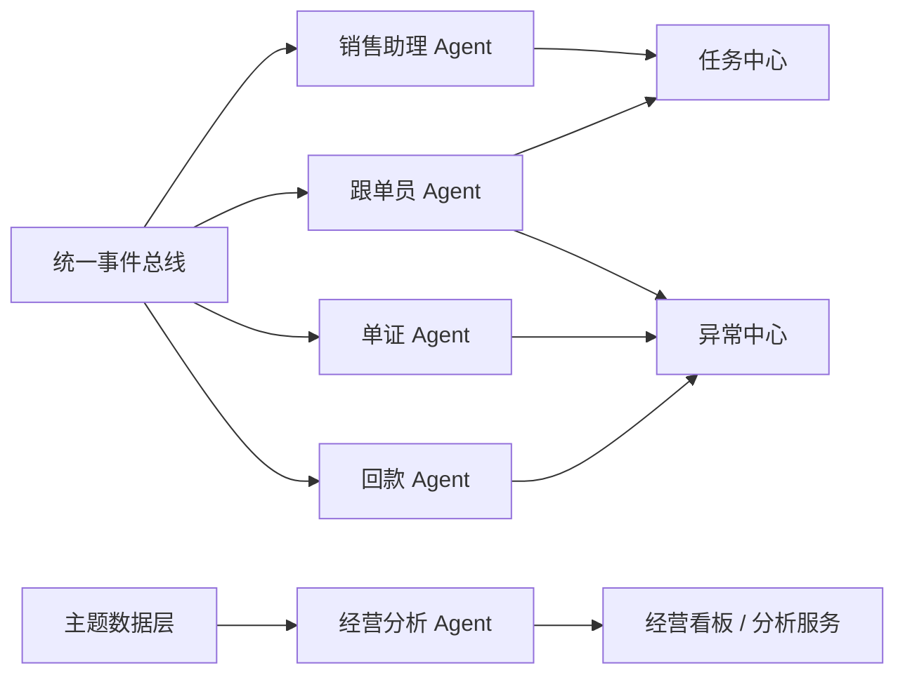

# 智能体职责矩阵与协同设计

## 1. 文档目的

本文档用于定义 AtlasTradeAI 中各类智能体的职责边界、输入输出、触发方式和协同关系。

## 2. 设计原则

智能体设计建议遵循以下原则：

- 一类智能体负责一类稳定业务职责
- 智能体不直接替代核心交易系统
- 智能体优先输出建议、任务和摘要
- 智能体之间通过事件和上下文协同，而不是强耦合调用

## 3. 智能体职责矩阵

| 智能体 | 核心职责 | 主要输入 | 主要输出 | 第一阶段优先级 |
| --- | --- | --- | --- | --- |
| 销售助理 Agent | 总结沟通、推荐跟进动作 | CRM 跟进、邮件、客户画像 | 摘要、跟进建议、客户提醒 | 中 |
| 跟单员 Agent | 盯订单流转、识别延期与阻塞 | 订单状态、交付事件、异常、回款状态 | 跟进建议、任务、提醒、风险标记 | 高 |
| 单证 Agent | 校验单证一致性、识别缺失 | 单证文件、订单、发货信息 | 缺失项、校验结果、补齐建议 | 中 |
| 回款 Agent | 跟踪账期与逾期风险 | 应收、开票、回款事件、客户历史付款 | 回款提醒、风险预警、催收建议 | 中 |
| 经营分析 Agent | 输出经营洞察和管理摘要 | 主题数据层、指标服务 | 分析结论、异常解释、管理建议 | 中 |

## 4. 智能体触发方式

建议统一采用四类触发方式：

- 事件触发
- 定时巡检
- 人工发起
- 异常升级触发

## 5. 智能体协同图

## 6. 第一阶段优先级判断

第一阶段最适合先落地的智能体是：

- 跟单员 Agent

原因：

- 业务价值最直接
- 与订单主线天然贴合
- 可以直接建立事件驱动闭环
- 容易和任务中心、异常中心联动

## 7. 协同原则

多智能体协同建议遵循以下原则：

- 一个事件可以触发多个智能体，但每个智能体职责不同
- 智能体输出结果优先落到任务、异常、摘要，而不是直接改业务主数据
- 管理类智能体优先消费主题数据层，而不是直接消费大量原始系统数据

## 8. 文档结论

AtlasTradeAI 的智能体体系应采用“单 Agent 先行，多 Agent 递进”的建设方式。

第一阶段以跟单员 Agent 为突破口，后续再逐步扩展为销售、单证、回款和经营分析的协同体系。
