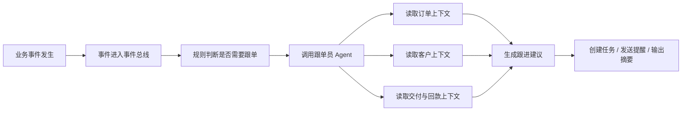
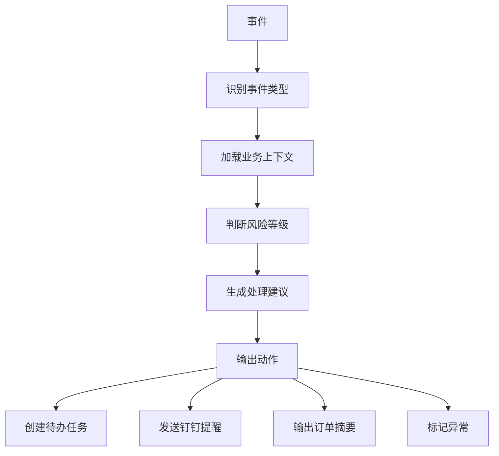
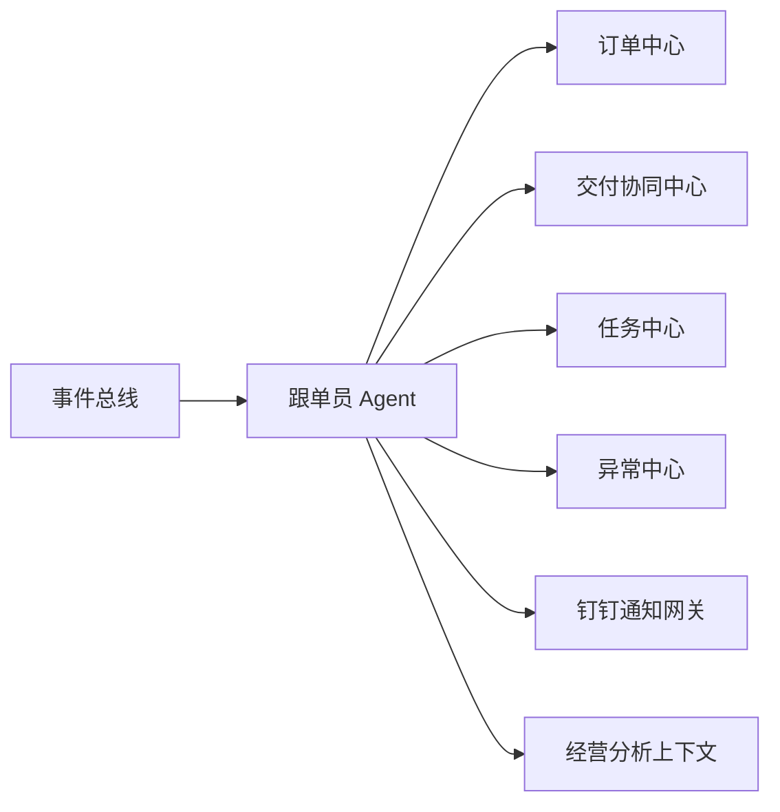

# 跟单员 Agent 事件驱动设计

## 1. 文档目的

本文档用于定义 AtlasTradeAI 第一阶段最重要的智能体之一：跟单员 Agent。

它的目标不是替代人工跟单员，而是帮助跟单员及时发现订单流转中的关键变化、异常风险和待处理事项，并以事件驱动的方式自动生成跟进动作。

## 2. 跟单员 Agent 的定位

跟单员 Agent 的定位是：

- 订单流转监控助手
- 多系统状态汇总助手
- 异常跟进建议助手
- 任务触发助手

它不直接承担最终交易确认权，也不直接修改关键财务结果，而是：

- 发现问题
- 组织上下文
- 提示动作
- 协助推进

## 3. 为什么要做事件驱动

传统跟单工作大量依赖人工轮询：

- 去 CRM 看客户是否回复
- 去 ERP 看订单和库存有没有变化
- 去问工厂进度
- 去看物流是否更新
- 去催财务确认回款

这种方式效率低，而且容易漏掉异常。

更合理的方式是：

当业务状态变化时，由事件触发跟单动作。

也就是：

不是“人去找问题”，而是“系统把需要跟进的问题主动推出来”。

## 4. 跟单员 Agent 的核心工作流

## 5. 跟单员 Agent 关注的核心对象

跟单员 Agent 应重点围绕以下对象工作：

- 订单
- 订单行项目
- 客户
- 报价记录
- 交付里程碑
- 生产进度
- 物流节点
- 单证状态
- 应收与回款状态
- 异常记录

## 6. 触发 Agent 的关键事件

建议第一阶段先支持最有价值的一批事件。

### 6.1 销售前端事件

- 客户回复关键邮件
- 报价被接受
- 样品反馈返回
- 订单确认

### 6.2 订单执行事件

- ERP 中生成正式订单
- 采购单创建
- 库存不足
- 排产延期
- 生产节点未按时完成
- 质检不通过

### 6.3 发货与单证事件

- 发货计划临近
- 出库完成
- 物流节点异常
- 单证缺失
- 报关异常

### 6.4 财务与回款事件

- 开票完成
- 回款临近到期
- 回款逾期
- 对账差异

## 7. 事件到动作的转换逻辑

跟单员 Agent 的关键能力，不是只看到事件，而是把事件转换成具体动作。

## 8. 跟单员 Agent 的输入

为了让 Agent 做出稳定判断，建议输入至少包括：

- 当前事件信息
- 订单当前状态
- 最近一次里程碑状态
- 客户重要级别
- 交期承诺
- 当前异常记录
- 物流状态
- 回款状态
- 历史类似订单处理记录

## 9. 跟单员 Agent 的输出

第一阶段建议输出以“辅助”为主，而不是直接自动执行所有动作。

建议输出包括：

- 跟进建议
- 风险摘要
- 下一步推荐动作
- 钉钉提醒内容草稿
- 待办任务草稿
- 对销售或跟单员可读的状态说明

## 10. 典型场景设计

### 10.1 场景一：订单交期存在延期风险

事件：

- 生产里程碑超时

Agent 输出：

- 判断该订单可能影响发货日期
- 汇总订单金额、客户等级、承诺交期
- 建议优先联系工厂确认恢复时间
- 创建跟进任务
- 给负责人发送钉钉提醒

### 10.2 场景二：发货前发现单证不完整

事件：

- 单证校验失败

Agent 输出：

- 标记为发货阻塞风险
- 列出缺失项
- 提示联系单证人员补齐资料
- 更新订单关注项

### 10.3 场景三：回款接近账期但尚未到账

事件：

- 回款即将逾期

Agent 输出：

- 生成客户回款提醒建议
- 汇总历史付款表现
- 建议销售优先联系客户确认付款计划

## 11. 跟单员 Agent 与其他模块的关系

它与各模块的协同方式如下：

- 从订单中心读取订单主状态
- 从交付协同中心读取执行进度
- 向任务中心写入待跟进事项
- 向异常中心写入风险标记
- 通过通知网关触达责任人

## 12. 第一阶段实现原则

第一阶段不建议把跟单员 Agent 做成全自动执行系统，而应坚持以下原则：

- 先做提醒和建议
- 再做任务自动创建
- 最后再做受控自动动作

也就是说，优先级应是：

可见 > 可提醒 > 可建议 > 可执行

## 13. 第一阶段最小可行能力

如果要做 MVP，建议跟单员 Agent 第一阶段只实现以下能力：

- 监听关键订单事件
- 汇总订单上下文
- 生成一段可读的跟进摘要
- 自动创建跟进任务
- 向钉钉发送提醒
- 标记订单风险等级

这几个能力已经可以显著降低人工盯单成本。

## 14. 后续扩展方向

在基础版本稳定后，可以逐步扩展：

- 自动识别高风险订单
- 自动推荐催办对象
- 自动生成客户同步话术
- 多事件合并分析
- 与销售 Agent、单证 Agent 协同

## 15. 文档结论

跟单员 Agent 应当成为 AtlasTradeAI 中最先落地的业务智能体之一。

它最适合建立在事件驱动架构之上，并以订单、交付、异常、回款四类上下文为核心输入，通过提醒、任务和建议的方式帮助人工跟单员更高效地推进业务。
