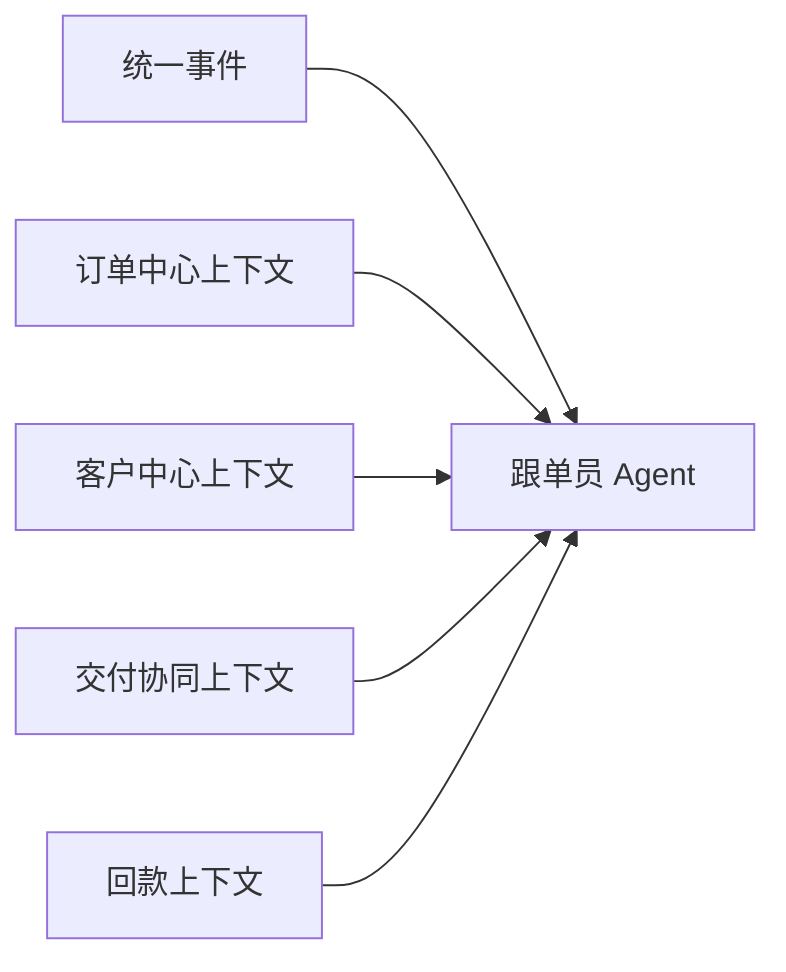
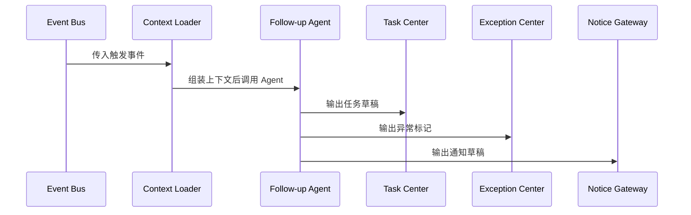

# 跟单员 Agent 输入输出协议

## 1. 文档目的

本文档用于定义跟单员 Agent 的输入、输出和处理边界，作为后续实现该 Agent 的协议草案。

## 2. 设计目标

该协议需要保证：

- 输入结构稳定
- 输出结构清晰
- 可以承接事件驱动
- 可以连接任务中心、异常中心和钉钉通知

## 3. 输入结构

建议 Agent 的输入分为五部分。

### 3.1 触发事件

- `event_id`
- `event_type`
- `event_time`
- `source_system`
- `biz_object_type`
- `biz_object_id`

### 3.2 订单上下文

- `order_id`
- `order_no`
- `current_status`
- `sub_status`
- `risk_level`
- `planned_delivery_date`
- `payment_status`

### 3.3 客户上下文

- `customer_id`
- `customer_name`
- `customer_level`
- `business_type`
- `owner_id`

### 3.4 履约上下文

- `milestones`
- `latest_logistics_status`
- `document_status`
- `customs_status`
- `exceptions`

### 3.5 回款上下文

- `receivable_amount`
- `received_amount`
- `due_date`
- `overdue_days`

## 4. 输入示意图

## 5. 输出结构

建议输出以下字段：

- `summary`
- `risk_assessment`
- `recommended_actions`
- `task_drafts`
- `exception_marks`
- `notification_draft`

## 6. 输出说明

### 6.1 摘要

用于给业务人员快速理解当前问题。

### 6.2 风险评估

建议至少输出：

- 风险等级
- 风险类型
- 风险原因

### 6.3 推荐动作

建议输出 1 到 3 条最关键动作，不要生成过多建议。

### 6.4 任务草稿

建议包含：

- 任务标题
- 责任角色
- 截止时间建议
- 优先级

### 6.5 异常标记

如果事件足以构成异常，可建议创建异常记录。

### 6.6 通知草稿

用于发送到钉钉或其他触达通道。

## 7. 输入输出时序

## 8. 第一阶段控制边界

第一阶段建议限制 Agent 权限：

- 可以生成建议
- 可以生成任务草稿
- 可以生成异常建议
- 可以生成通知草稿

不建议第一阶段直接允许：

- 自动修改 ERP 正式单据
- 自动关闭异常
- 自动变更核心财务状态

## 9. 文档结论

跟单员 Agent 的协议必须稳定、简单、可控。

第一阶段应把重点放在“上下文整合 + 建议输出 + 任务触发”上，而不是追求复杂自动执行。
