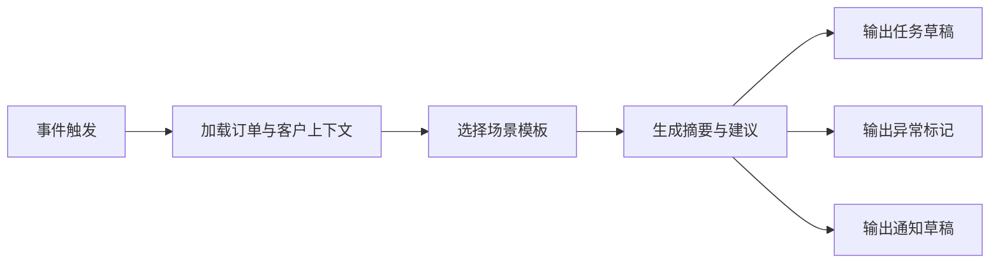

# 跟单员 Agent 场景用例集与提示词框架

## 1. 文档目的

本文档用于整理跟单员 Agent 第一阶段的典型业务场景，并给出可用于后续实现的提示词（Prompt）框架草案。

## 2. 设计目标

本文档主要解决两个问题：

- 跟单员 Agent 在哪些场景下最有价值
- 提示词应该如何围绕业务上下文组织

## 3. 第一阶段优先场景

建议优先覆盖以下场景：

- 订单确认后待排产过久
- 生产里程碑超时
- 待发货阶段停滞
- 单证缺失导致发货阻塞
- 物流延迟
- 回款临期
- 回款逾期

## 4. 场景用例表

| 场景 | 触发事件 | 核心输入 | 期望输出 |
| --- | --- | --- | --- |
| 订单待排产过久 | `order.status_changed` 后长时间未推进 | 订单状态、计划时间、客户等级 | 跟进建议、任务草稿 |
| 生产延期 | `production.milestone_delayed` | 订单、里程碑、异常、交期 | 风险摘要、任务、提醒 |
| 发货阻塞 | `document.missing` | 单证状态、订单状态、发货计划 | 缺失项说明、催办建议 |
| 物流延误 | `logistics.delayed` | 物流节点、客户、交期承诺 | 风险说明、客户同步建议 |
| 回款临期 | `payment.due_soon` | 账期、历史付款、客户等级 | 催收建议、提醒草稿 |
| 回款逾期 | `payment.overdue` | 应收、逾期天数、历史表现 | 高风险提醒、异常建议 |

## 5. 场景流程图



## 6. 提示词框架建议

建议提示词结构分为六段。

### 6.1 角色定义

例如：

你是一个贸易公司的智能跟单员助手，负责根据订单、交付、单证、回款等上下文判断当前风险，并给出最关键的下一步跟进建议。

### 6.2 目标说明

例如：

你的目标不是复述数据，而是帮助业务人员快速判断当前问题、优先级和下一步动作。

### 6.3 输入上下文

包括：

- 触发事件
- 订单信息
- 客户信息
- 交付状态
- 回款状态
- 当前异常

### 6.4 输出要求

例如要求输出：

- 一段简明摘要
- 风险等级
- 最多三条建议动作
- 是否建议创建任务
- 是否建议标记异常
- 一条钉钉提醒文案

### 6.5 业务规则约束

例如：

- 不要直接建议修改 ERP 正式财务数据
- 优先围绕当前订单节点给建议
- 如果风险不明确，不要夸大
- 优先给出可以执行的动作

### 6.6 输出格式约束

例如：

要求输出结构化 JSON 或固定字段块，便于系统解析。

## 7. 提示词模板草案

```text
你是贸易公司经营系统中的跟单员 Agent。

你的任务是根据触发事件和订单上下文，输出最关键的跟进建议。

请基于以下信息进行判断：
1. 触发事件
2. 订单状态
3. 客户等级
4. 交付里程碑
5. 单证 / 物流 / 回款状态
6. 当前异常

请按以下格式输出：
- summary: 一段不超过120字的摘要
- risk_assessment: 风险等级、风险类型、风险原因
- recommended_actions: 最多3条动作建议
- task_drafts: 若需要，输出任务草稿
- exception_marks: 若需要，输出异常建议
- notification_draft: 生成一条可发送给钉钉的提醒文案
```

## 8. 文档结论

跟单员 Agent 的第一阶段效果，很大程度上取决于是否选对场景，以及是否把提示词约束在可执行、可解析、可控的范围内。

因此，场景用例集和提示词框架应作为实现前必须准备的文档资产。
