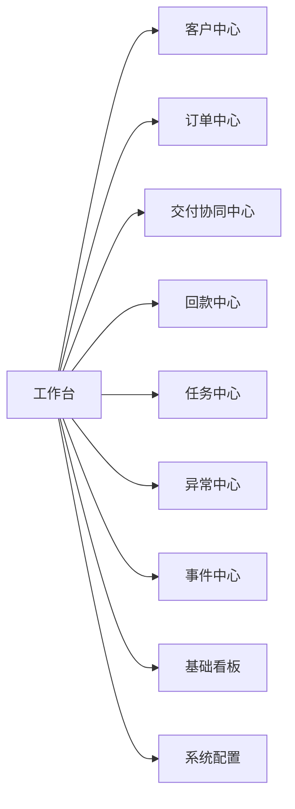
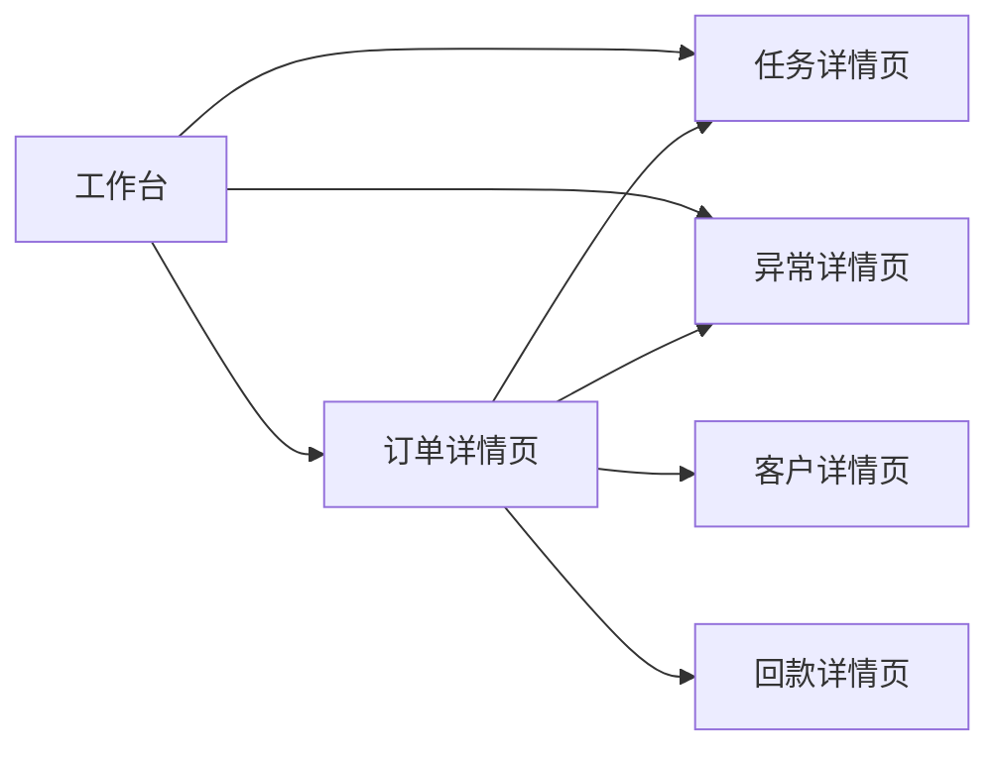

# 功能模块清单与页面结构草案

## 1. 文档目的

本文档用于把 AtlasTradeAI 的业务架构与系统蓝图进一步落到产品结构层，明确：

- 第一阶段需要有哪些功能模块
- 各模块在产品中的页面结构如何组织
- 用户如何在系统中完成主要业务动作

## 2. 产品设计原则

第一阶段产品设计建议遵循以下原则：

- 以订单主线为核心导航
- 优先满足跟单、运营、管理的高频场景
- 页面结构围绕“主视图 + 详情页 + 工作台”展开
- 不重复建设 CRM 和 ERP 已经擅长的复杂录入能力

## 3. 第一阶段产品模块总览

建议第一阶段优先建设以下模块：

- 工作台
- 客户中心
- 订单中心
- 交付协同中心
- 回款中心
- 任务中心
- 异常中心
- 事件中心
- 基础看板
- 系统配置

## 4. 一级导航建议

建议产品一级导航采用：

- 工作台
- 客户
- 订单
- 交付
- 回款
- 任务
- 异常
- 看板
- 配置

## 5. 模块与页面结构草案

### 5.1 工作台

工作台建议承接最核心的待办与预警。

建议页面内容：

- 我的待办
- 高风险订单
- 今日关键节点
- 回款临期提醒
- 最新异常
- Agent 摘要卡片

### 5.2 客户中心

建议页面结构：

- 客户列表页
- 客户详情页
- 客户经营视图

客户详情页建议包含：

- 基础资料
- 联系人
- 报价记录
- 订单记录
- 回款记录
- 异常记录

### 5.3 订单中心

建议页面结构：

- 订单列表页
- 订单详情页
- 订单主视图看板

订单详情页建议包含：

- 基础信息
- 当前状态与子状态
- 里程碑时间轴
- 任务列表
- 异常列表
- 单证状态
- 发货状态
- 回款状态
- Agent 摘要

### 5.4 交付协同中心

建议页面结构：

- 交付订单列表
- 里程碑监控页
- 延期风险页

建议重点呈现：

- 待排产
- 生产中
- 待发货
- 已发货
- 交付延期风险

### 5.5 回款中心

建议页面结构：

- 回款列表页
- 应收账龄页
- 回款风险页

建议重点呈现：

- 待回款订单
- 部分回款订单
- 逾期订单
- 客户回款表现

### 5.6 任务中心

建议页面结构：

- 我的任务
- 团队任务
- 逾期任务
- 按订单查看任务

### 5.7 异常中心

建议页面结构：

- 异常列表
- 高优先异常
- 按类型查看异常
- 异常处理详情

### 5.8 事件中心

建议页面结构：

- 事件流列表
- 关键事件过滤
- 事件详情页

第一阶段可以先做轻量版本，用于排查与追踪。

### 5.9 基础看板

建议页面结构：

- 销售与订单看板
- 交付看板
- 回款看板
- 异常看板

### 5.10 系统配置

建议页面结构：

- 客户与订单映射配置
- 事件规则配置
- 通知规则配置
- 用户与角色配置

## 6. 关键页面关系图

## 7. 角色视角建议

### 7.1 跟单员视角

重点使用：

- 工作台
- 订单中心
- 交付协同中心
- 任务中心
- 异常中心

### 7.2 销售视角

重点使用：

- 工作台
- 客户中心
- 订单中心
- 回款中心

### 7.3 管理层视角

重点使用：

- 工作台
- 基础看板
- 异常中心
- 订单中心

## 8. 第一阶段页面优先级建议

### 8.1 P0 页面

- 工作台
- 订单列表页
- 订单详情页
- 任务列表页
- 异常列表页

### 8.2 P1 页面

- 客户列表页
- 客户详情页
- 回款列表页
- 交付监控页

### 8.3 P2 页面

- 事件中心
- 配置中心
- 管理看板

## 9. 文档结论

第一阶段产品结构应围绕“工作台 + 订单详情 + 任务异常联动”来组织，而不是一开始铺开过多复杂模块。

只要订单中心、任务中心、异常中心和工作台之间联动顺畅，产品就已经具备清晰的使用骨架。
