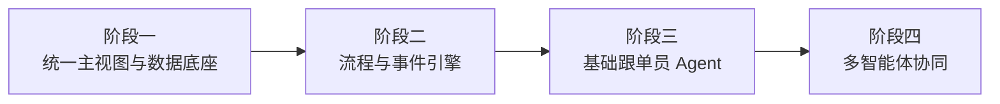

# 分阶段实施方案

## 1. 文档目的

本文档用于定义 AtlasTradeAI 从业务蓝图走向落地建设的阶段性实施路径。

## 2. 总体实施策略

本项目建议采用：

- 先主干、后扩展
- 先数据、后自动化
- 先事件、后 Agent
- 先跟单场景、后全面智能化

## 3. 分阶段路线图

## 4. 阶段一：统一主视图与数据底座

目标：

打通客户、订单、交付、回款主链。

重点建设：

- 数据同步与备份
- 客户主视图
- 订单主视图
- 交付主视图
- 回款主视图
- 基础看板

## 5. 阶段二：流程与事件引擎

目标：

建立系统主动感知与流程推动能力。

重点建设：

- 统一事件模型
- 事件总线
- 状态机
- 里程碑模型
- 任务中心
- 异常中心
- 钉钉通知机制

## 6. 阶段三：基础跟单员 Agent

目标：

让系统具备基础盯单和跟进辅助能力。

重点建设：

- 跟单员 Agent
- 关键事件触发
- 跟进建议生成
- 风险摘要生成
- 任务自动创建

## 7. 阶段四：多智能体协同

目标：

从单点跟单智能，扩展到多岗位协同智能。

重点建设：

- 销售助理 Agent
- 单证 Agent
- 回款 Agent
- 经营分析 Agent
- 多 Agent 协作机制

## 8. 实施结论

整个项目的落地顺序，应该围绕订单主线和事件主线展开。

第一批最值得投入的，不是“把所有功能都做出来”，而是先建立：

- 统一订单主线
- 统一事件机制
- 统一任务和异常中心
- 跟单员 Agent 的最小闭环
